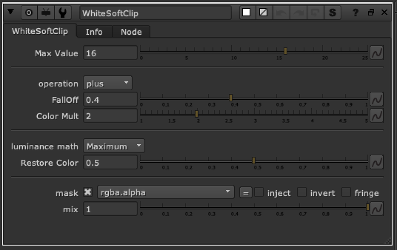
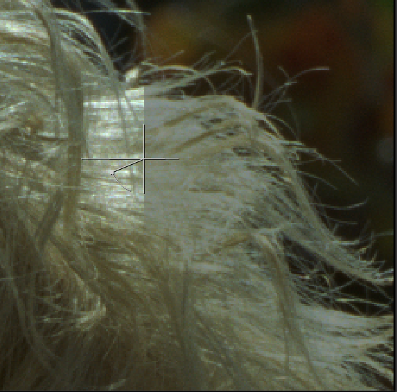
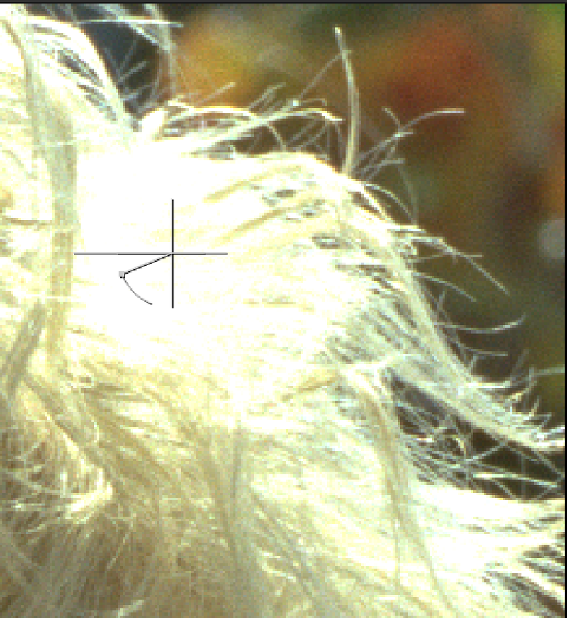

# WhiteSoftClip TL

**Author:** Tony Lyons - [https://compositingmentor.com](https://compositingmentor.com)

This tool's aim is to better approach the softClip tool. There are many times where you want to set a max value amount for the shot, 16, 25, 50, whichever. Unfortunately, the softClip tool in nuke tends to clamp all channels at the top amount equally, which seems to break the ratio between the channels and lose the color of the highlights.

Set the max value you'd like to max your highlights out at.

Adjust the FallOff and Color Mult to adjust where the whiteclipping begins in the highlights.

The Restore Color slider restores more of the color by pushing the ratio between the colors a bit farther apart and maintaining the original colors. Default is set to .5

