# AnimationCurve [AG]

**Author:** Andrea Geremia - [http://www.andreageremia.it/tutorial.html](http://www.andreageremia.it/tutorial.html)

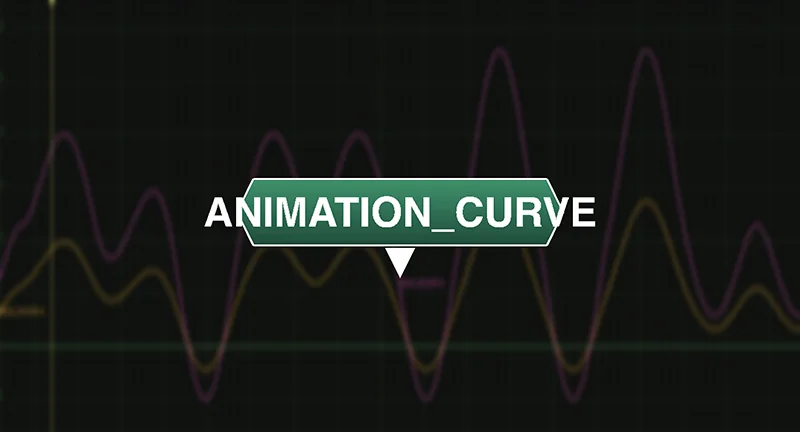

- [http://www.nukepedia.com/gizmos/other/animation_curve](http://www.nukepedia.com/gizmos/other/animation_curve)
- [http://www.andreageremia.it/tutorial_animation_nuke.html](http://www.andreageremia.it/tutorial_animation_nuke.html)

Generate or modify animation curves.

### All Functions

1. Wave Generator
2. New Range
3. Smooth Curves
4. Modify Curves
5. Fade
6. Reference Frame
7. Percentage
8. Average

---

### 1. Wave Generator

Generate a Wave with different options. Select the Type from the available options:

- Noise
- Random
- Sine
- Sine Blip
- Triangle
- Square
- Bounce
- Blip
- Saw Tooth
- Saw Parabolic
- Saw Parabolic Reverse
- Saw Exponential

---

### 2. New Range

Change the range of an Animation Curve. For example, if min and max values are -5 and 6, you can project all the curve in the new frame range -5 and 20.

Drag and Drop your curve in the knob Input and use the button to find out the min and max value, then insert your new values and check in the Curve Editor your new curve.

---

### 3. Smooth Curves

Smooth the curve with this tool. Insert your curve in the knob Input, select the Type (High or Low) and the power of the smooth.

---

### 4. Modify Curves

Modify curves with: Translate, Scale and Time Offset. With the checkbox you can activate or not the modifiers.

---

### 5. Fade

Create the fade/dissolve from start frame till end frame. Animate mix or another knob from 0-1 or 1-0.

**Types:**
- Linear
- Slow-in Slow-out
- Slow-in Linear-out
- Linear-in Slow-out

*Based on David Ozols' tutorial*

---

### 6. Reference Frame

Set a reference frame. This means your curve will be set to 0 in that frame. Basically it will be translated to 0 in the Reference Frame.

---

### 7. Percentage

Increase or Decrease the curve by a X percentage.

---

### 8. Average

A single value for the entire curve. It will return the average value for the curve.

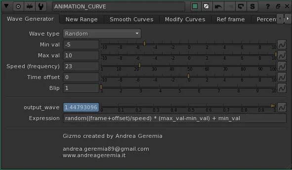

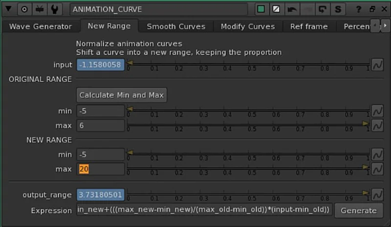

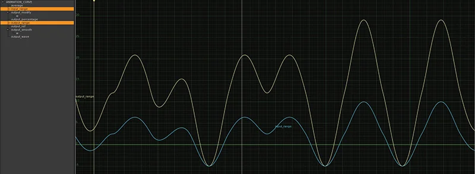

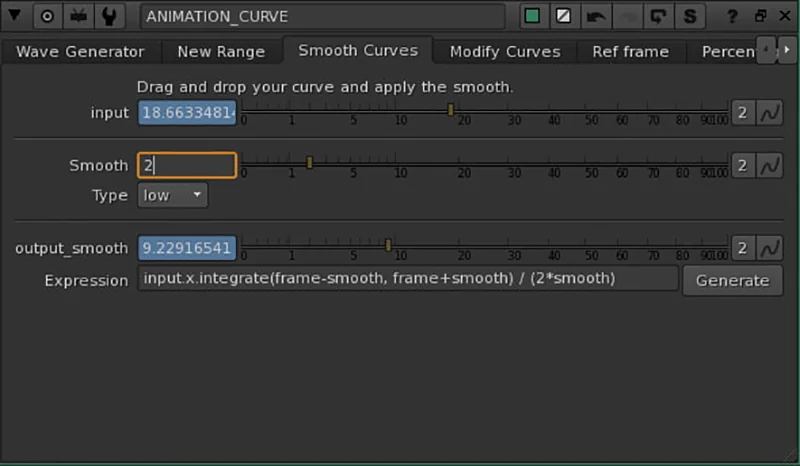

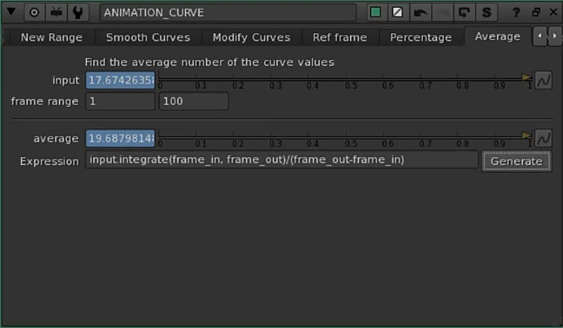

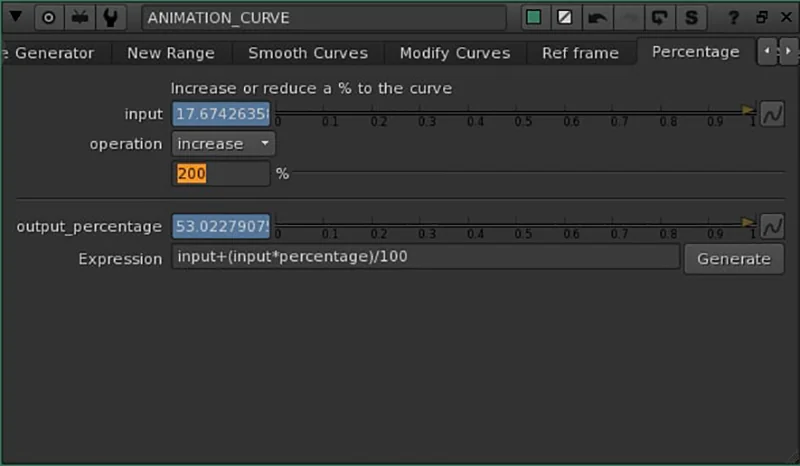

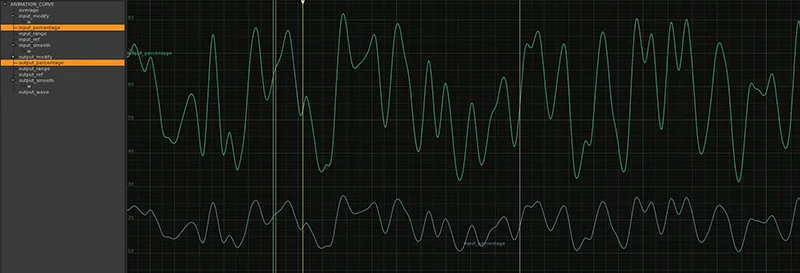

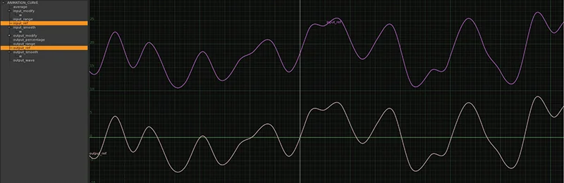

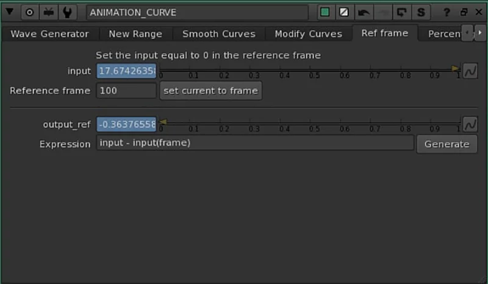

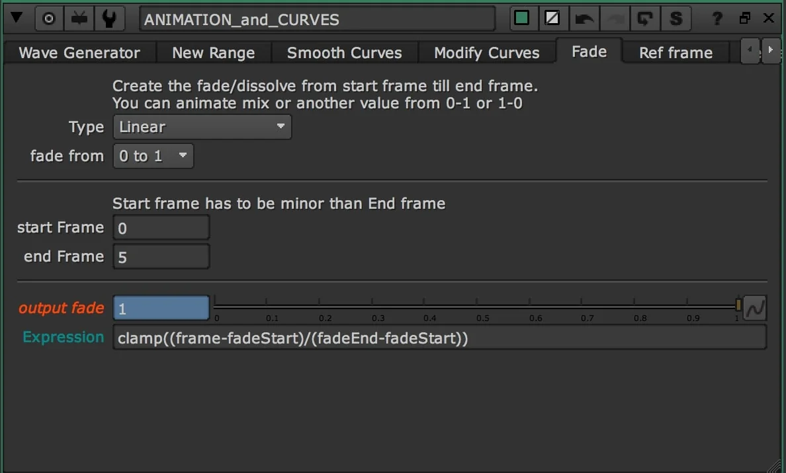

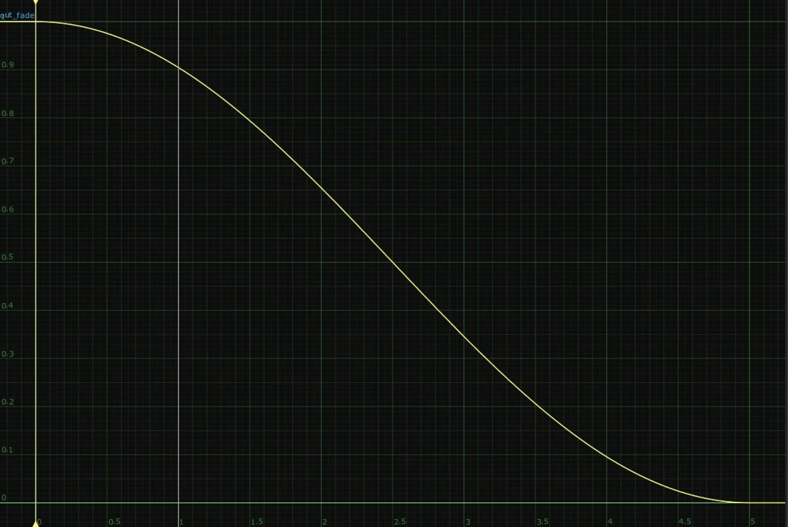

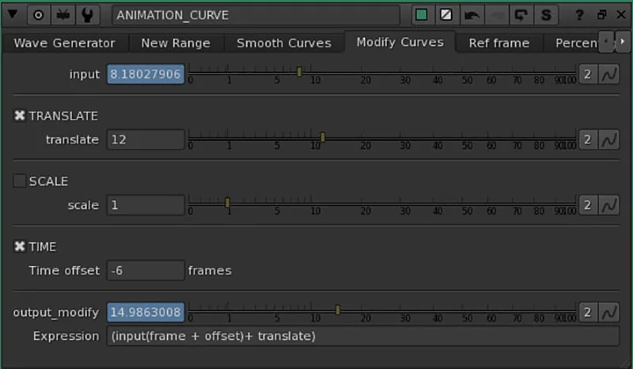

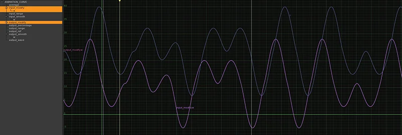

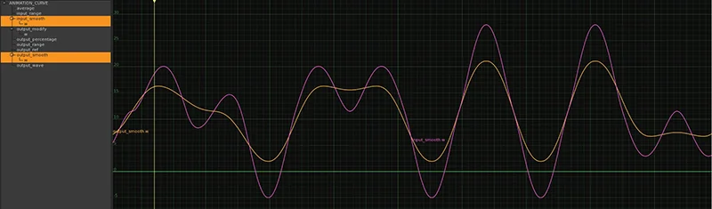
