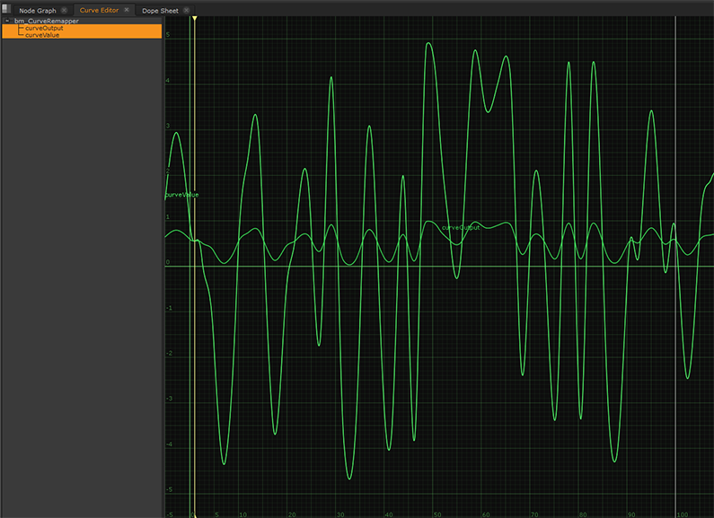
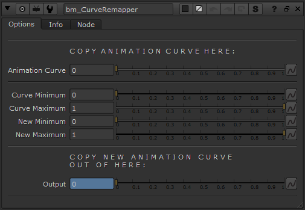

# CurveRemapper [BM]

**Author:** Ben McEwan - [https://benmcewan.com/blog/](https://benmcewan.com/blog/)

- [http://www.nukepedia.com/gizmos/other/bm_curveremapper](http://www.nukepedia.com/gizmos/other/bm_curveremapper)

Useful for remapping arbitrary animation curves, such as those from the CurveTool.
### How to Use
1. Input the animation's min & max values
2. Set new min & max values
3. The curve will be remapped to the new range

