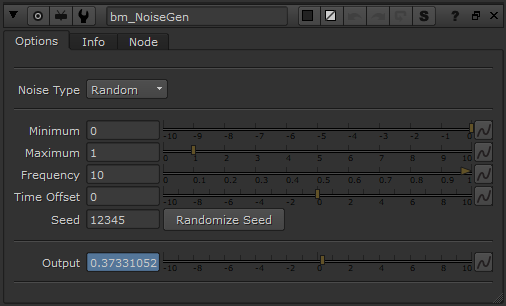

# NoiseGen [BM]

**Author:** Ben McEwan - [https://benmcewan.com/blog/](https://benmcewan.com/blog/)

- [https://benmcewan.com/nukeTools.html](https://benmcewan.com/nukeTools.html)

Generates a random noise curve based on a minimum, maximum & frequency value.
*Modified so the output curve will work with Wave Machine toolset.*

