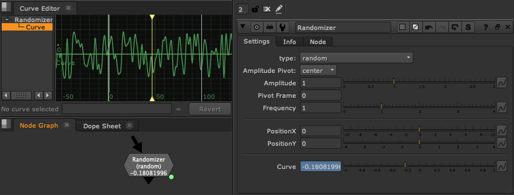

# Randomizer [TL]

**Author:** Tony Lyons - [http://www.CompositingMentor.com](http://www.CompositingMentor.com)

Randomizer is aimed at being a simple curve manipulation tool. It is meant to be used with the curve editor and to have terminology relating to graphs.
### Curve Types
- random
- noise
- sine
- triangle
- square
- bounce
- sawtooth
- sawtooth (parabolic)
- sawtooth (parabolic reversed)
- sawtooth (exponential)
- blip
- sine blip
### Parameters
**Amplitude:** Scales the curve in the Y axis. You can set the pivot of the scale point to either center, min, or max, depending on how you want your curve to scale.

**Frequency:** Scales the curve in the X axis, and pivot frame serves as the pivot point for the X axis scale, so if you set to frame 1050 and scale the frequency, frame 1050 will remain the same value and scale outward from there.
**Position X and Position Y:** Simple controls to move the curve up and down and left and right on the curve editor.
### Advanced Usage
You can sort of 'stack' or drive multiple curves by expression linking another curve/randomizer into the Position Y, amplitude, or frequency knobs, or by manually animating them. You can achieve some pretty dynamic results.
**Squarify option:** Makes random and noise steppy, and includes a random seed button.

This tool can also be used with the Wave Machine toolset.
