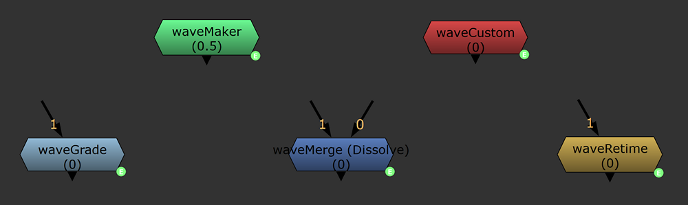
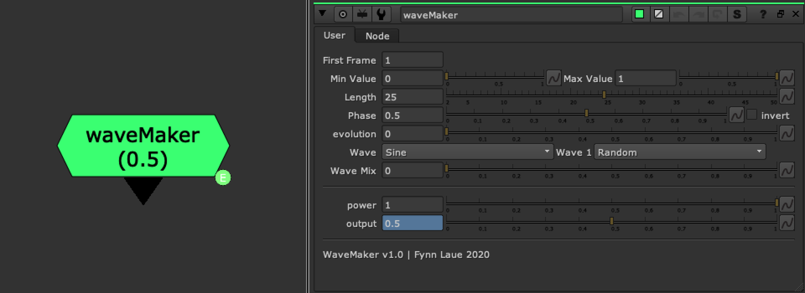
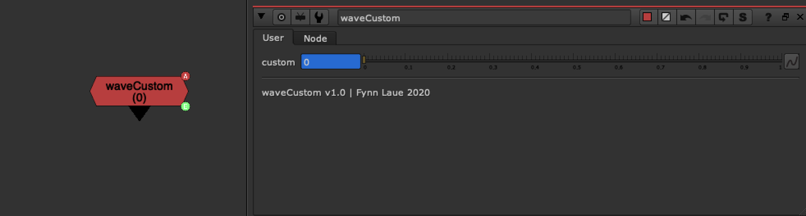
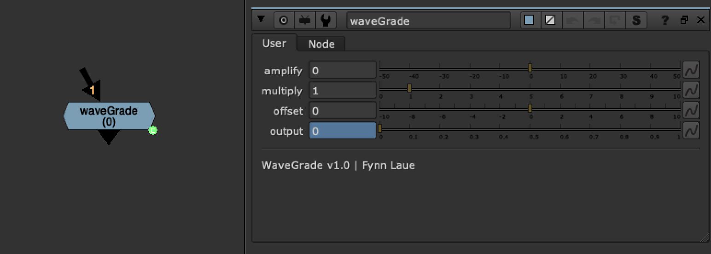
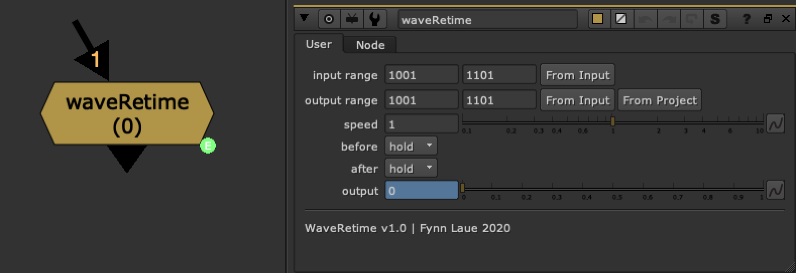
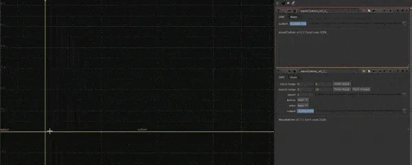
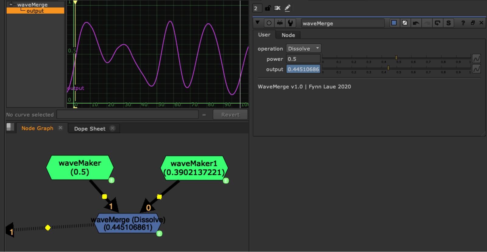

# WaveMachine [FL]

**Author:** Fynn Laue - [http://www.fynnlaue.com](http://www.fynnlaue.com)

- [https://www.nukepedia.com/toolsets/other/wavemachine](https://www.nukepedia.com/toolsets/other/wavemachine)

Node Based Animation - Generate and modify animation curves with this toolset collection.
---

<video autoplay loop muted playsinline style="width:100%">
  <source src="../img/tools/curves/wavemachine-6.mp4" type="video/mp4">
</video>

<video autoplay loop muted playsinline style="width:100%">
  <source src="../img/tools/curves/wavemachine-10.mp4" type="video/mp4">
</video>

