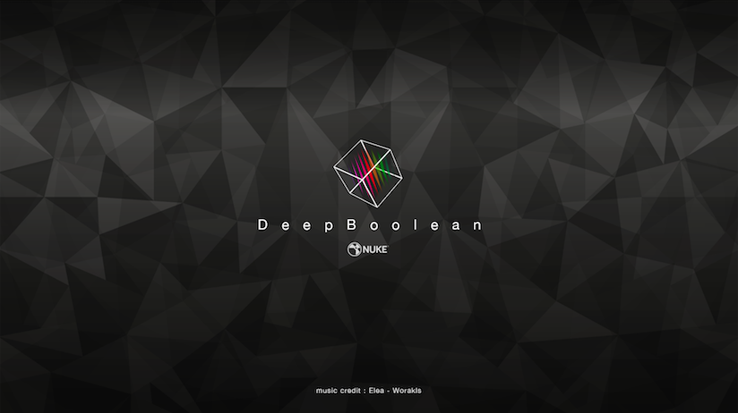
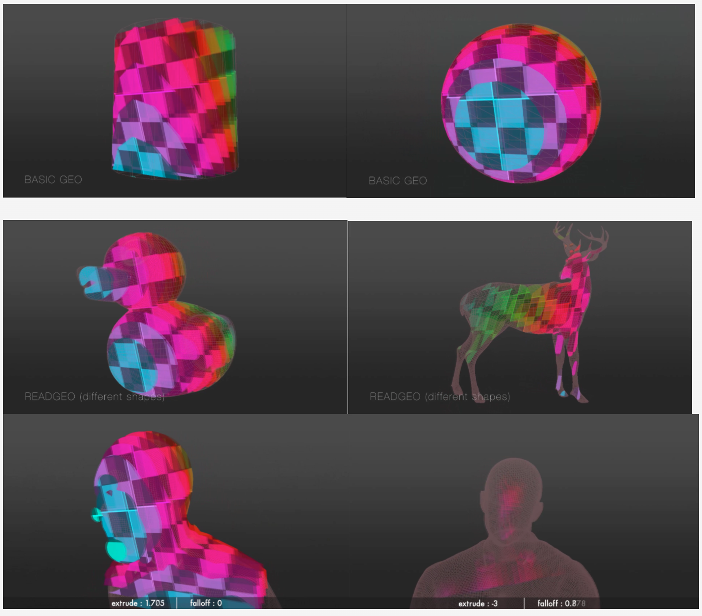
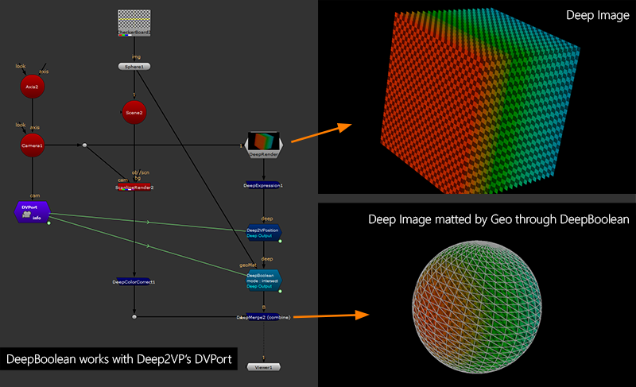
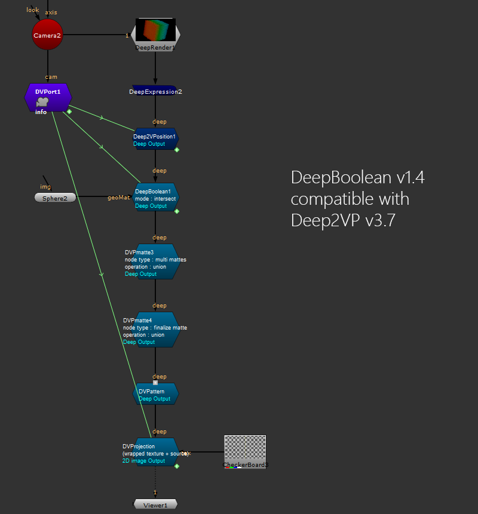

# DeepBoolean [MJT]

**Author:** Mark Joey Tang - [http://www.facebook.com/MJTlab](http://www.facebook.com/MJTlab)

- [http://www.nukepedia.com/gizmos/deep/deepboolean](http://www.nukepedia.com/gizmos/deep/deepboolean)
- [http://bit.ly/menupy](http://bit.ly/menupy)
- Video: [https://vimeo.com/354811205](https://vimeo.com/354811205)
- Video: [https://vimeo.com/322695922](https://vimeo.com/322695922)

DeepBoolean works like Maya's boolean tool, but for deep in Nuke. It works like deepHoldout but with more function than that.
### Modes
- **Intersect mode:** Keep the deep data inside the geo matte
- **Subtract mode:** Holdout the deep data outside of the geo matte
Both support geo matte extrude (erode in Nuke terms) and falloff in 3D space.

Any geo needs to be closed face because this tool uses camera space Normal deep matte.

It works with any kind of ReadGeo or basic geo in Nuke (cube might have a bit strange behavior on extrude because of separate faces).
*Note: Before Nuke11, DeepExpression had some strange behavior, which Foundry fixed in Nuke11. So this tool only works and is tested in Nuke11. If you are using a lower version, this tool will not work properly.*
Works with Deep2VP v3.7+, can link the camera data through DVPort and stack with DVPmatte.

