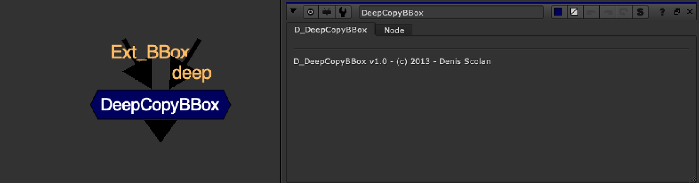

# DeepCopyBBox [NKPD]

**Author:** Denis Scolan

- [http://www.nukepedia.com/gizmos/deep/d_deepcopybbox](http://www.nukepedia.com/gizmos/deep/d_deepcopybbox)

CopyBBox for deep image stream.

This gizmo helps you carry the BBox of your 2D stream onto your deep image stream.

It's useful for reintroducing the BBox after a DeepMerge in 'holdout' mode.
*Note: You can only copy the BBox from a 2D stream, it doesn't work with a deep stream yet.*
