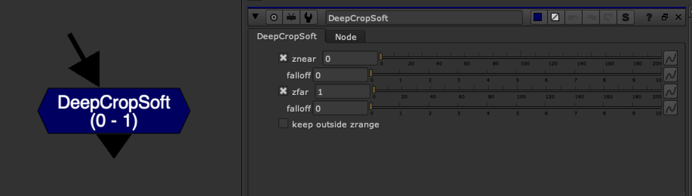

# DeepCropSoft [NKPD]

**Author:** Wouter Gilsing - [http://www.woutergilsing.com](http://www.woutergilsing.com)

- [http://www.nukepedia.com/gizmos/deep/deepcropsoft](http://www.nukepedia.com/gizmos/deep/deepcropsoft)

A version of the DeepCrop node that allows the user to set a falloff for a soft transition. Can be used to gradually fade off anything that reaches a specific distance from the camera (like anything super close). This can for example be useful to prevent visible 'popping' when a camera moves through geometry.
*Minor tweaking of the original knob positions to make it slightly easier to use.*
