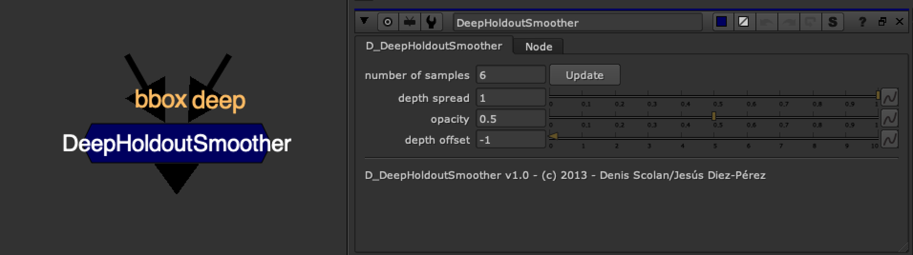

# DeepHoldoutSmoother [NKPD]

**Author:** Denis Scolan + Jesús Diez-Pérez

- [http://www.nukepedia.com/gizmos/deep/d_deepholdoutsmoother](http://www.nukepedia.com/gizmos/deep/d_deepholdoutsmoother)

Smoothing the harsh holdout intersection that occurs when the holdout itself doesn't have enough samples (coming from a standard Z pass for instance).

The D_DeepHoldoutSmoother is meant to be inserted in your tree on the holdout stream and before the DeepHoldout/DeepMerge(holdout mode) node.

Keep in mind that the holdout will expand slightly and also the more you increase the samples the heavier your comp will get.
*Thank you to Jesús Diez-Pérez for the Python script.*
