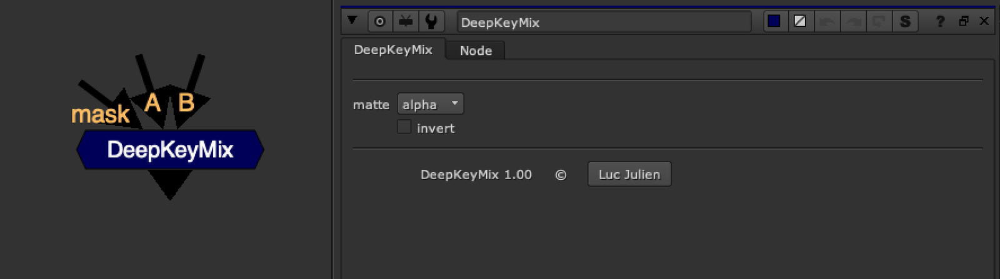

# DeepKeyMix [NKPD]

**Author:** Luc Julien

- [http://www.nukepedia.com/gizmos/deep/deepkeymix](http://www.nukepedia.com/gizmos/deep/deepkeymix)

Same basic function as the original keymix but for deep input.

It enables you to copy deep channels from A to B only where the mask input is non-zero. The mask input uses standard channels.
