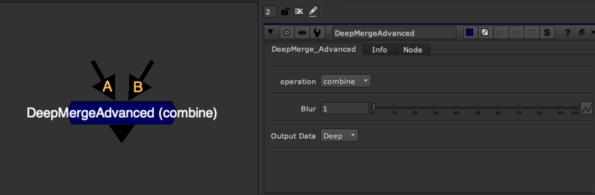

# DeepMerge_Advanced [BM]

**Author:** Ben McEwan - [https://benmcewan.com/nukeTools.html](https://benmcewan.com/nukeTools.html)

- [https://github.com/BenMcEwan/nuke_public/tree/master/gizmos](https://github.com/BenMcEwan/nuke_public/tree/master/gizmos)

- Merges all channels from A and B in deep
- Fixes issue with DeepMerge's holdout operation which exists in Nuke 11
- Choose between a Deep or 2D output
- Soften/Blur slider which helps blend the 2 deep renders using a DeepExpression and deep.front and deep.back
