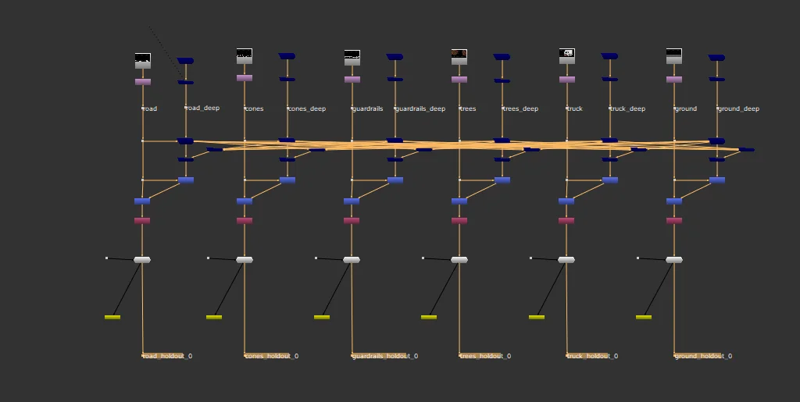
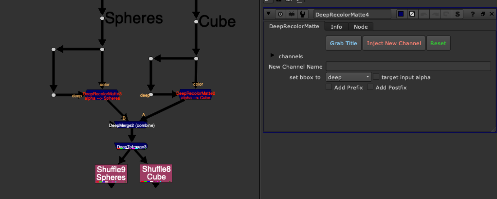

# DeepRecolorMatte [TL]

**Author:** Tony Lyons - [http://www.CompositingMentor.com](http://www.CompositingMentor.com)

There is a popular deep workflow used in production where you deep combine many elements together, and have to make deepHoldouts for each layer, usually pre-rendering out the alpha channel for each individual layer, to use later, in order to reduce heaviness.

A great article is written about this method from Boris MC: [http://boris-mc.com/?p=2700](http://boris-mc.com/?p=2700)
There is also a nice video explaining the workflow: [https://vimeo.com/429161580](https://vimeo.com/429161580)
This workflow can often get chaotic quite quickly with lots of objects holding out each other.
### How It Works
This tool aims to speed up and simplify this workflow even further. It creates a new layer with the alpha channel of the element and a custom name.

Using additional channels and deepMerging all of the elements together into 1 big scene, you can later pull out the mattes from each individual element, giving you the matte of that element, held out by all other elements in the scene. This is a custom holdout matte for that object.

The goal would be to prerender just 1 render with all channels, and simply shuffle out the deep holdout mattes for any element you need.
### Features
- **Grab Title button:** Uses functions from Adrian Pueyo's stamps plugin to try and predict the layername from the deep input
- **Prefix/Postfix options:** Add "ID" prefix for "ID_newLayer" or "matte" postfix for "newLayer_matte"
- **Inject New Channel:** Click to inject - the node's text will turn red and label will change
- **Reset:** Restore default state of the node
- **Target Input Alpha:** Use if your alpha from color input is different than the alpha from deep input
All channels are just a single .red channel to save time during the deep merge process, since each layer and each channel must be calculated.

