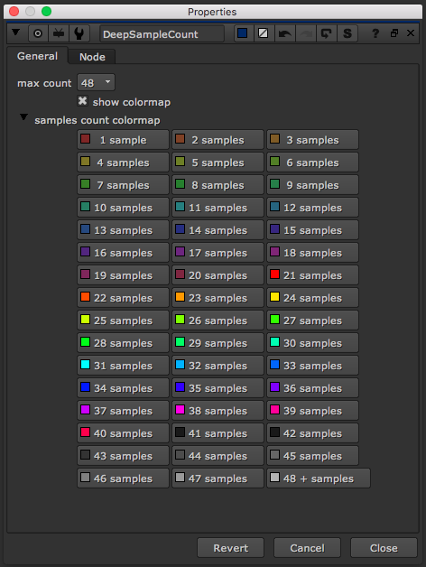
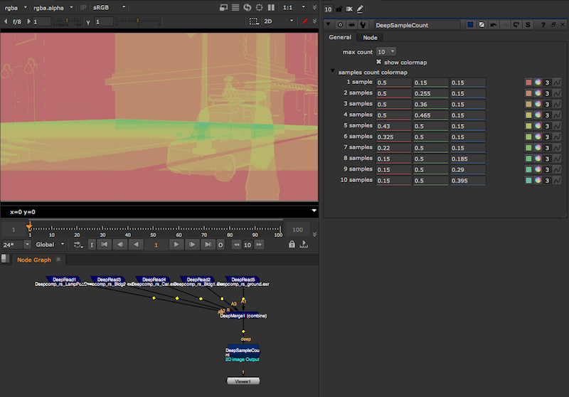

# DeepSampleCount [MJT]

**Author:** Mark Joey Tang - [http://www.facebook.com/MJTlab](http://www.facebook.com/MJTlab)

- [http://www.nukepedia.com/gizmos/deep/deepsamplecount_v11](http://www.nukepedia.com/gizmos/deep/deepsamplecount_v11)

Convert the amount of samples per pixel into colormap visual. Helps for troubleshooting, investigating the cause of slow deep trees, or tool development.

The setup runs by some math & TCL expression, able to run in realtime with fast feedback.

It will create a channel called 'deepSample.count', which stores the total samples per pixel.
*Supports detecting up to 48 samples per pixel on v1.2+*

