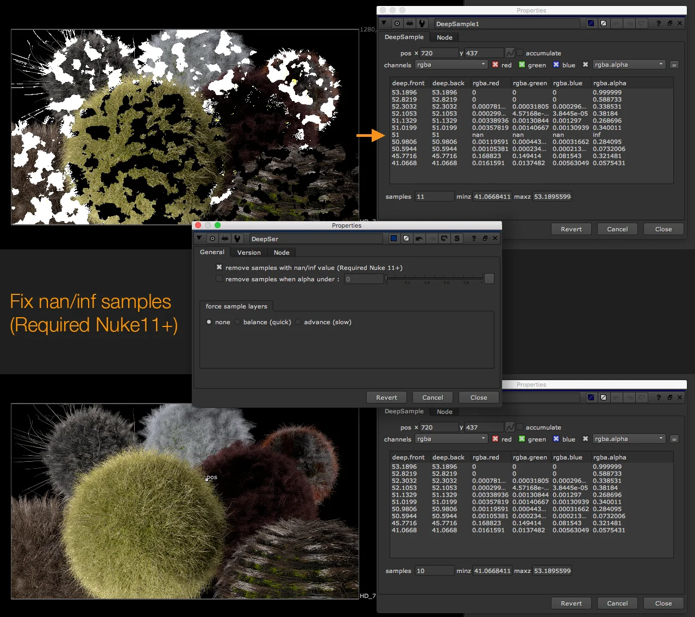
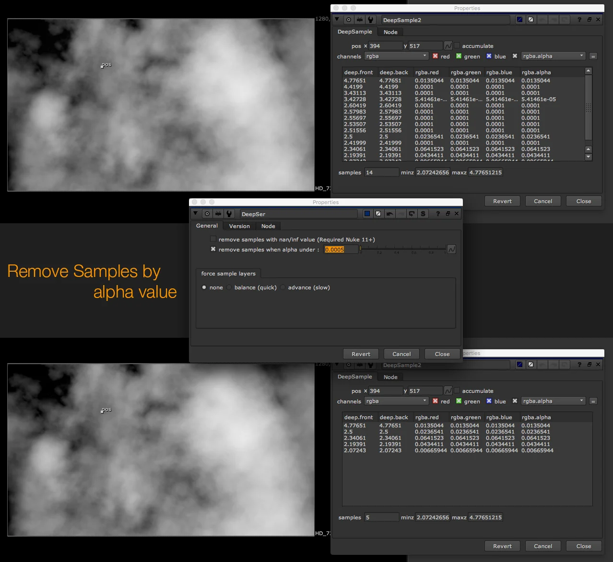

# DeepSer [MJT]

**Author:** Mark Joey Tang - [http://www.facebook.com/MJTlab](http://www.facebook.com/MJTlab)

- [http://www.nukepedia.com/gizmos/deep/deepser](http://www.nukepedia.com/gizmos/deep/deepser)

A tool to manage/remove/optimize deep samples.
### Features
- Remove NaN/Inf samples
- Remove samples by alpha value
- Remove samples by layer in pixel
*Deep sample colormap can be generated by DeepSampleCount*

