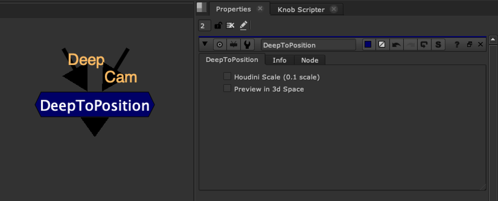
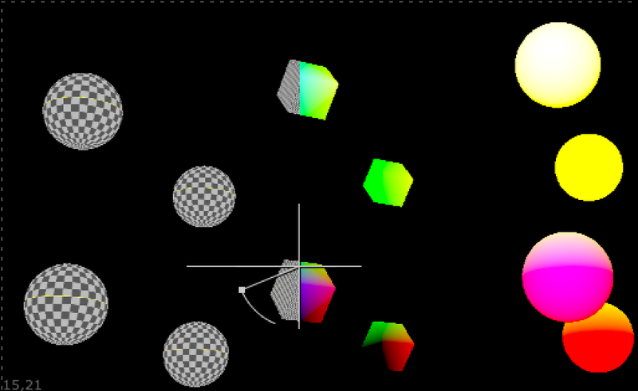
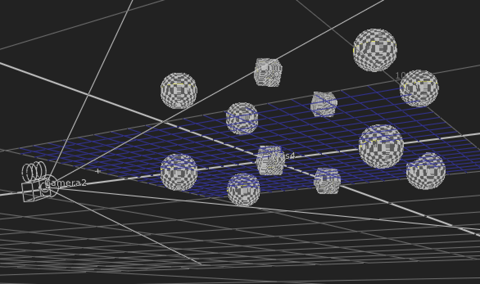
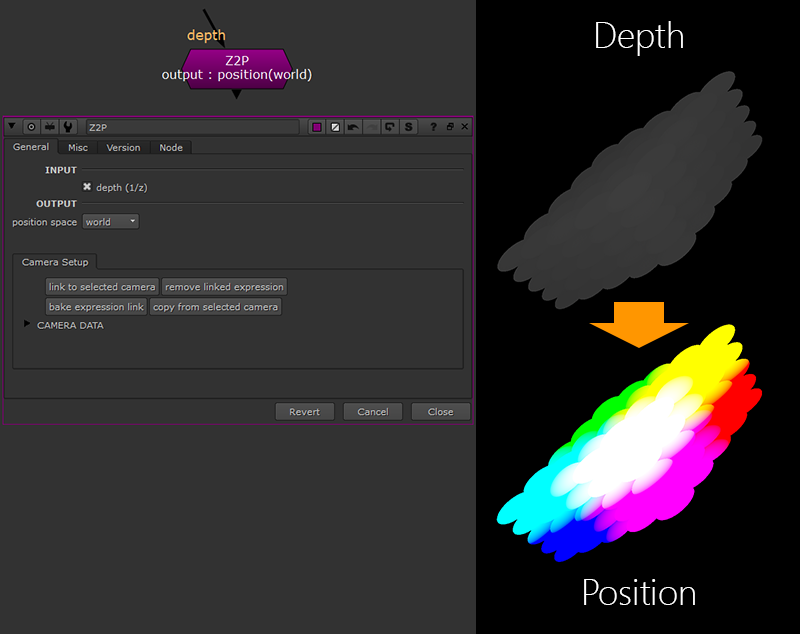

# DeepToPosition [TL]

**Author:** Tony Lyons - [http://www.CompositingMentor.com](http://www.CompositingMentor.com)

Plug in your deep render and your camera and this node will convert the deep into a WorldPosition pass.

There was an option when using Houdini renders that the scale was off, so there is a Houdini scale compensation checkbox.

There is also a preview in 3D space option for seeing where your deep exists in Nuke's 3D viewer.

