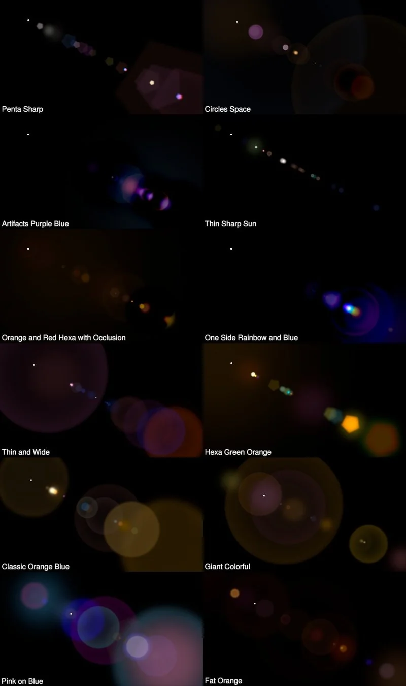

# AutoFlare NKPD

**Author:** Vincent Wauters - [http://www.vincentwauters.com](http://www.vincentwauters.com)

- [http://www.nukepedia.com/gizmos/filter/autoflare](http://www.nukepedia.com/gizmos/filter/autoflare)
- [http://vincentwauters.com/programming/autoflare20-for-nuke](http://vincentwauters.com/programming/autoflare20-for-nuke)

This is an automatic lens flare filter based on image content and values.

It is using simple expressions and convolution filters to create lens flares. Since it is based on image content, there are no position parameters, and therefore no need to track the hotspots in the image.

