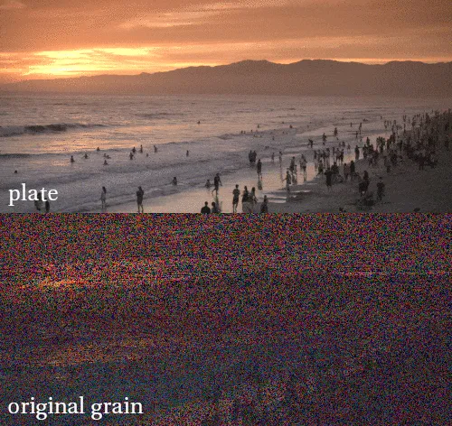

# DasGrain FH

**Author:** Fabian Holtz

- [http://www.nukepedia.com/gizmos/other/dasgrain](http://www.nukepedia.com/gizmos/other/dasgrain)

Semiautomatic regraining tool.

DasGrain takes the pain out of the re-graining process by automatically adapting the plate grain to your comp.

For areas where the original grain doesn't work, you can generate a new grain that is based on the original grain.

Having a good degrain is crucial for this tool!

