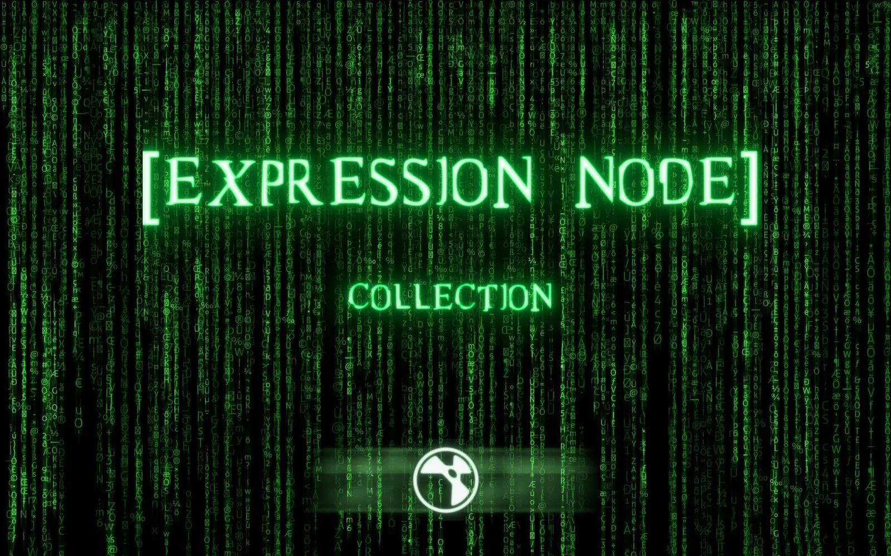

# Expression Nodes AG

**Author:** Andrea Geremia  
**Website:** [http://www.andreageremia.it/tutorial.html](http://www.andreageremia.it/tutorial.html)

- [http://www.andreageremia.it/tutorial_expression_node.html](http://www.andreageremia.it/tutorial_expression_node.html)
- [http://www.nukepedia.com/gizmos/other/expression-node-collection-for-nuke](http://www.nukepedia.com/gizmos/other/expression-node-collection-for-nuke)
- Video: [https://vimeo.com/364508565](https://vimeo.com/364508565)

Various premade expressions. Separated into 6 categories. Please go to the first link above for full details on Andrea Geremia's main website.

1. CREATIONS
2. ALPHA
3. PIXEL
4. KEYING and DESPILL
5. TRANSFORM
6. 3D and DEEP

| Tool | Author | Description |
|------|--------|-------------|
| [UV_Map](uv-map.md) | AG | Creates a standard UV map with overscan percent options |

