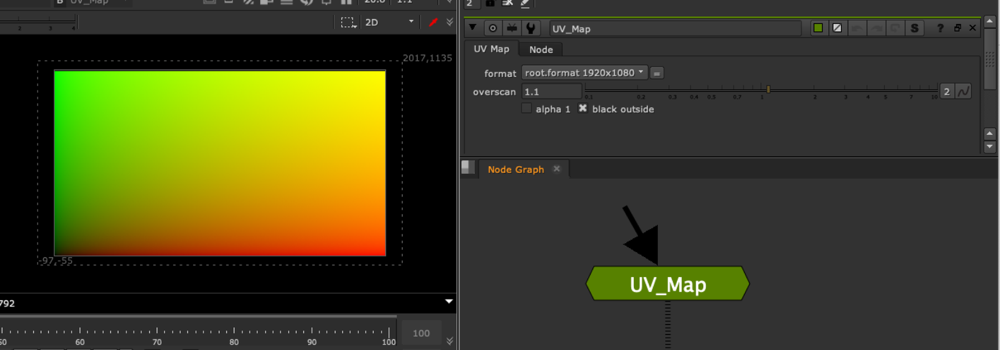

# UV_Map AG

**Author:** Andrea Geremia - [http://www.andreageremia.it/tutorial.html](http://www.andreageremia.it/tutorial.html)

- [http://www.andreageremia.it/tutorial_expression_node.html](http://www.andreageremia.it/tutorial_expression_node.html)
- [http://www.nukepedia.com/gizmos/other/expression-node-collection-for-nuke](http://www.nukepedia.com/gizmos/other/expression-node-collection-for-nuke)
- Video: [https://vimeo.com/364508565](https://vimeo.com/364508565)

From Expression AG menu.

Creates a standard UV map with overscan percent options.

