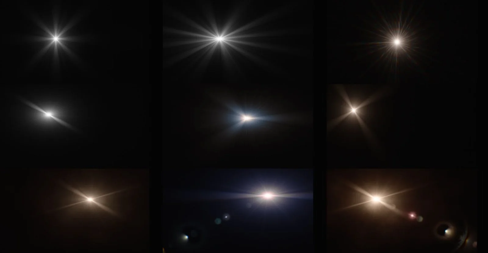

# FlareSuperStar NKPD

**Author:** Lukas Fabian

- [http://www.nukepedia.com/gizmos/draw/flaresuperstar](http://www.nukepedia.com/gizmos/draw/flaresuperstar)

Main features:
- Easily create star flares with separate controls over rays, glare and glow
- Automatic animation on the glare either by shimmer (over time) and/or by changing the position of the flare
- Rays are very customizable and have controls for adjusting thickness and angle + spread (or shrink) from a specific distance
- Position the flare either manual or let it spawn automatically from the highlights of an input image with convolve mode
