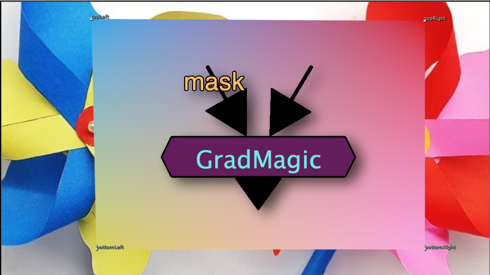

# GradMagic TL

**Author:** Tony Lyons - [http://www.CompositingMentor.com](http://www.CompositingMentor.com)

- [http://www.nukepedia.com/gizmos/draw/gradmagic](http://www.nukepedia.com/gizmos/draw/gradmagic)

A live sampling 4 point gradient tool with ability to bake colors.

