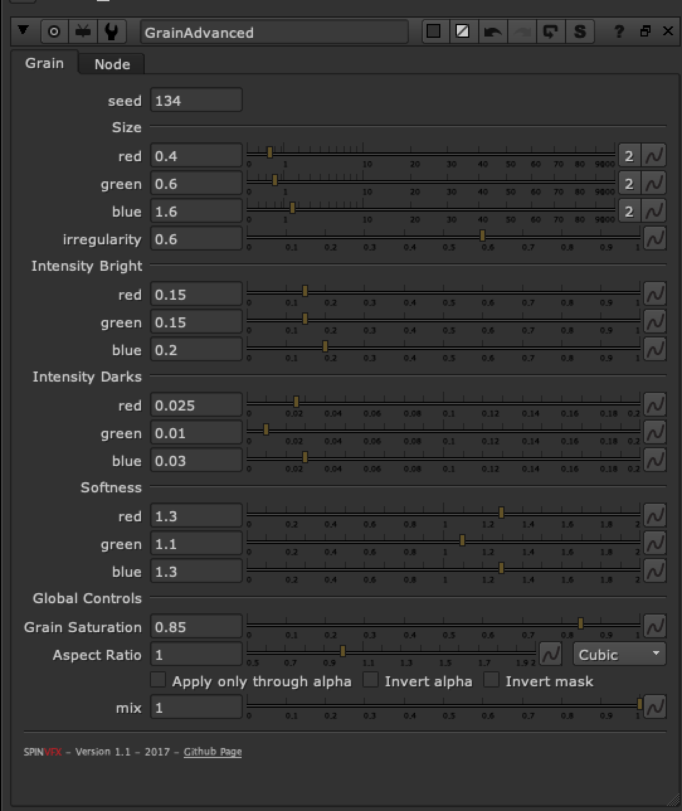

# GrainAdvanced SPIN

**Author:** Spin FX

- [http://www.nukepedia.com/gizmos/other/spin_nuke_gizmos-1](http://www.nukepedia.com/gizmos/other/spin_nuke_gizmos-1)
- [https://github.com/SpinVFX/spin_nuke_gizmos](https://github.com/SpinVFX/spin_nuke_gizmos)

Adds synthetic grain. The defaults are setup to resemble an HD Alexa plate's grain. You can adjust the sliders to match a sample grain.
