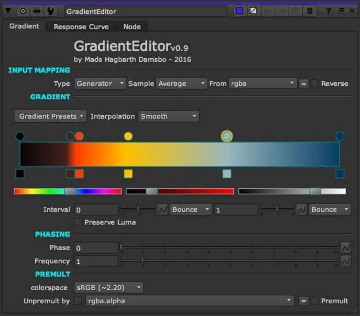

# Gradient Editor MHD

**Author:** Mads Hagbarth Damsbo - [https://hagbarth.net/blog/](https://hagbarth.net/blog/)

- [http://www.nukepedia.com/gizmos/draw/gradient-editor](http://www.nukepedia.com/gizmos/draw/gradient-editor)
- Video: [https://vimeo.com/223874378](https://vimeo.com/223874378)

This is a simple little visual gradient editor for Nuke.

