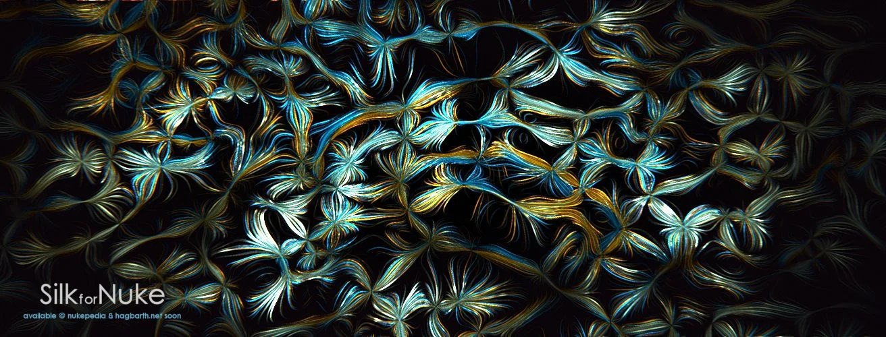

# Silk MHD

**Author:** Mads Hagbarth Damsbo - [https://hagbarth.net/blog/](https://hagbarth.net/blog/)

- [https://hagbarth.net/project/silk/](https://hagbarth.net/project/silk/)
- [https://www.nukepedia.com/gizmos/filter/silk](https://www.nukepedia.com/gizmos/filter/silk)
- Video: [https://vimeo.com/195532256](https://vimeo.com/195532256)
- Video: [https://vimeo.com/195883171](https://vimeo.com/195883171)

Silk is a creative 2d processing effect that takes your footage and turns it into laser spaghetti.

