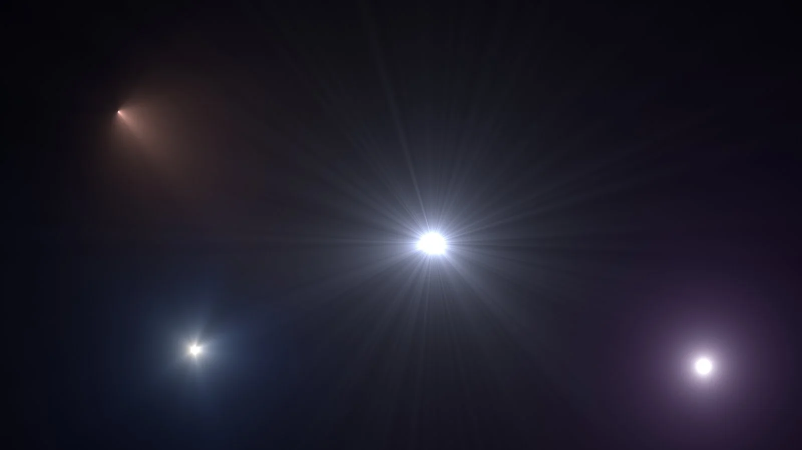

# SpotFlare MHD

**Author:** Mads Hagbarth Damsbo - [https://hagbarth.net/blog/](https://hagbarth.net/blog/)

- [https://hagbarth.net/project/spotflare/](https://hagbarth.net/project/spotflare/)
- [http://www.nukepedia.com/gizmos/draw/spot-flare](http://www.nukepedia.com/gizmos/draw/spot-flare)

Spotflare is a procedural flare generator, that generates a general radial light but also allow for light shimmer and "cone" masking.

At the core of spotflare is a radial light, that is generated from the inverse square of the distance to the center. Unlike a liniear falloff, a inverse square falloff gives a very realistic light look.

If you look at the diffrence between a gaussian and a gamma adjusted inverse square profile you can clearly see the effect.

