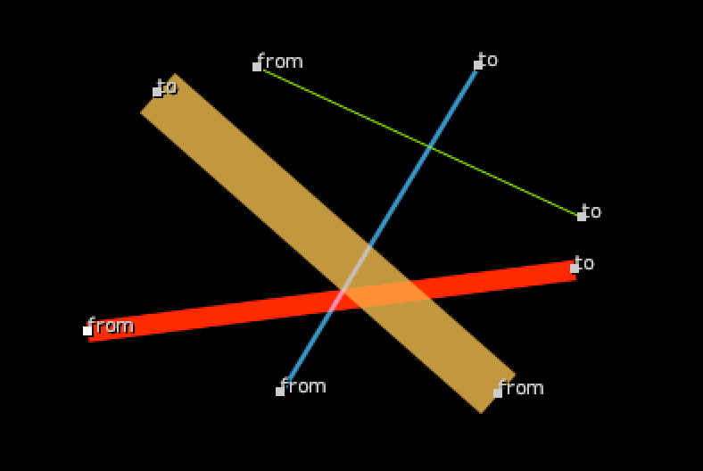

# LineTool NKPD

**Author:** Fredrik Brännbacka

- [http://www.nukepedia.com/gizmos/draw/mcp-line](http://www.nukepedia.com/gizmos/draw/mcp-line)

Line drawing gizmo. Use it to draw lines on an input or use it as an input draw node. Subsample or don't if you are drawing vertical or horizontal lines.
