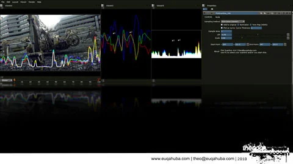

# PlotScanline NKPD

**Author:** Theodore Groembroome - [https://euqahuba.com/blog/?p=121](https://euqahuba.com/blog/?p=121)

Slice and plot scanlines in Nuke!

Set up point 1 and point 2 and calculate alone whole line from edge of frame to edge of frame or calculate only the area between the 2 points.
