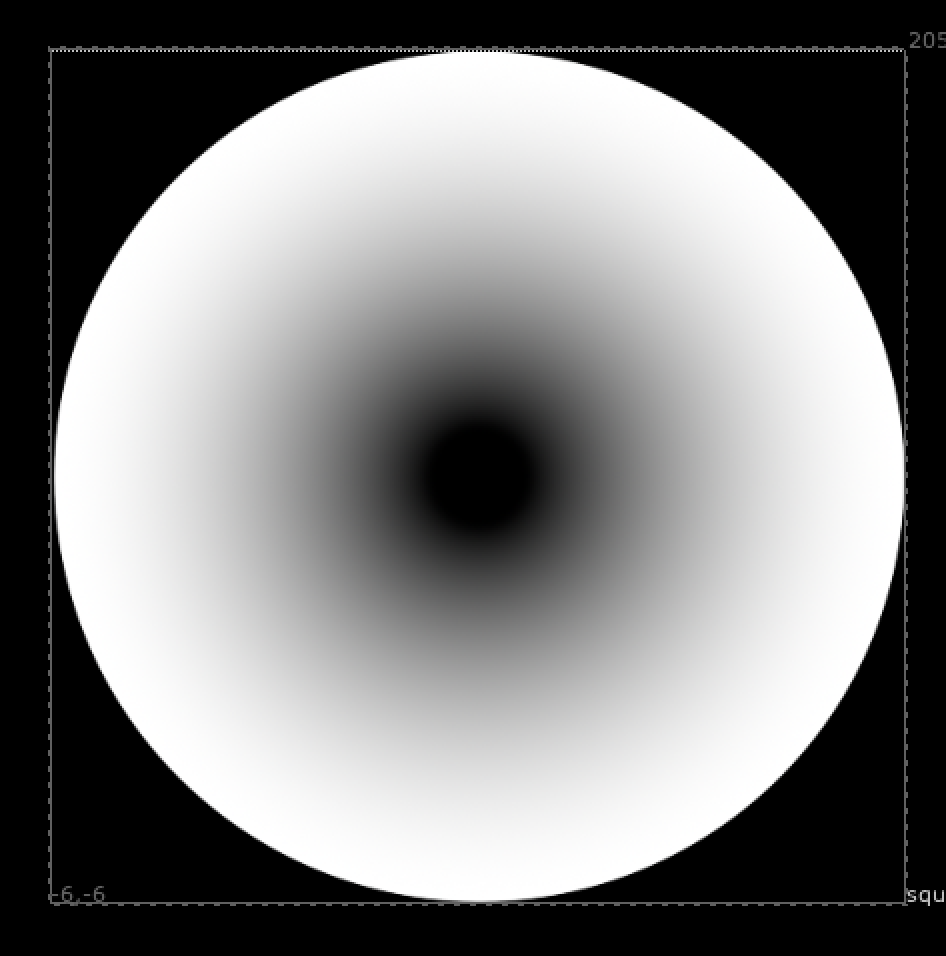

# RadialAdvanced TL

**Author:** Tony Lyons - [http://www.CompositingMentor.com](http://www.CompositingMentor.com)

A radial tool that creates a circle and ramped falloff to create a "ring" effect. Easy animation settings. Useful for shockwaves or other lookDev tasks.
