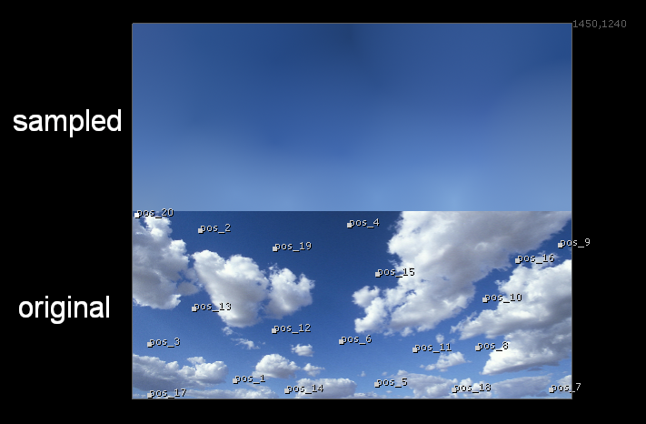
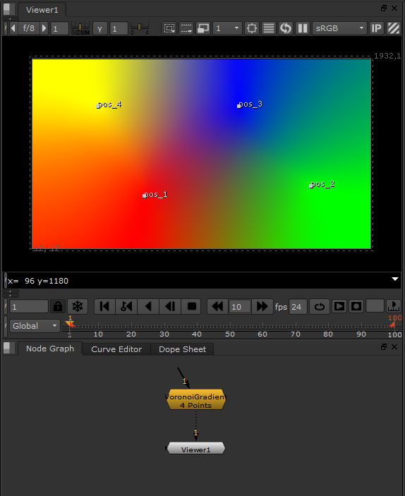
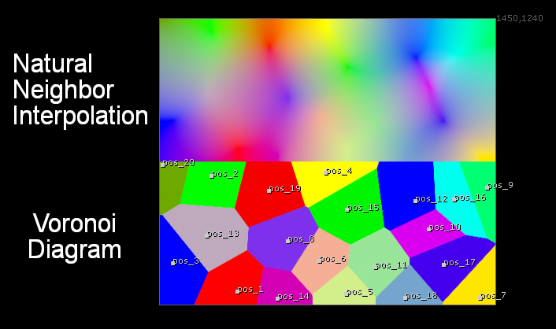
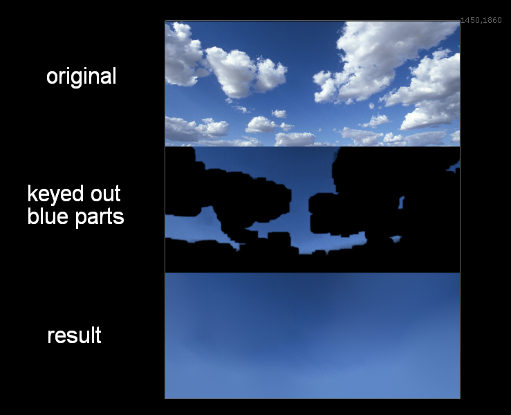

# VoronoiGradient NKPD

**Author:** Nikolai Wüstemann - [http://www.wuestemann.net](http://www.wuestemann.net)

- [http://www.nukepedia.com/gizmos/colour/voronoi-gradient/](http://www.nukepedia.com/gizmos/colour/voronoi-gradient/)

Nuke implementation for 2D Gradients. Create an arbitrary number of color-samples in 2D and produce a smooth, natural interpolation over the entire image.

The Gizmo uses Natural Neigbor Interpolation to calculate the pixels inbetween samples, using Blinkscripts.

You can also output the underlying Voronoi Diagram or play with the smoothness value to control the amount of the softening (0 = Voronoi Diagram, 1 = Accurate Natural Neighbor Interpolation).

Another important function is the ability to sample input colors, instead of defining them yourself. Setting the Type to 'Sample' uses all created points to sample the input colors at given positions. Furthermore you can use the 'Fill' Type to interpolate missing information in any image. A premultiplied input is required for this.

Changing the Colorspace will change the color falloff. This can be used to achieve the best artistic result. Setting the Colorspace to HSV for example, will interpolate the colors over the spectrum.

There are several tricks and hacks used in this Gizmo to make it work, so please report any bugs you find, I am sure there still are some.

The user knobs and the inside of the gizmo are well documented to help with understanding the concept.
(The algorithm implemented is not the elegant geometric process, but a simple brute-force method, which was easy to implement. This however makes the tool super slow and you might wanna use the speed optimization control to make it a little bit faster at the cost of some quality. That's why I would still consider the whole thing a proof of concept. Although, with my update to v2.7 I'd say we are production ready now :) )

