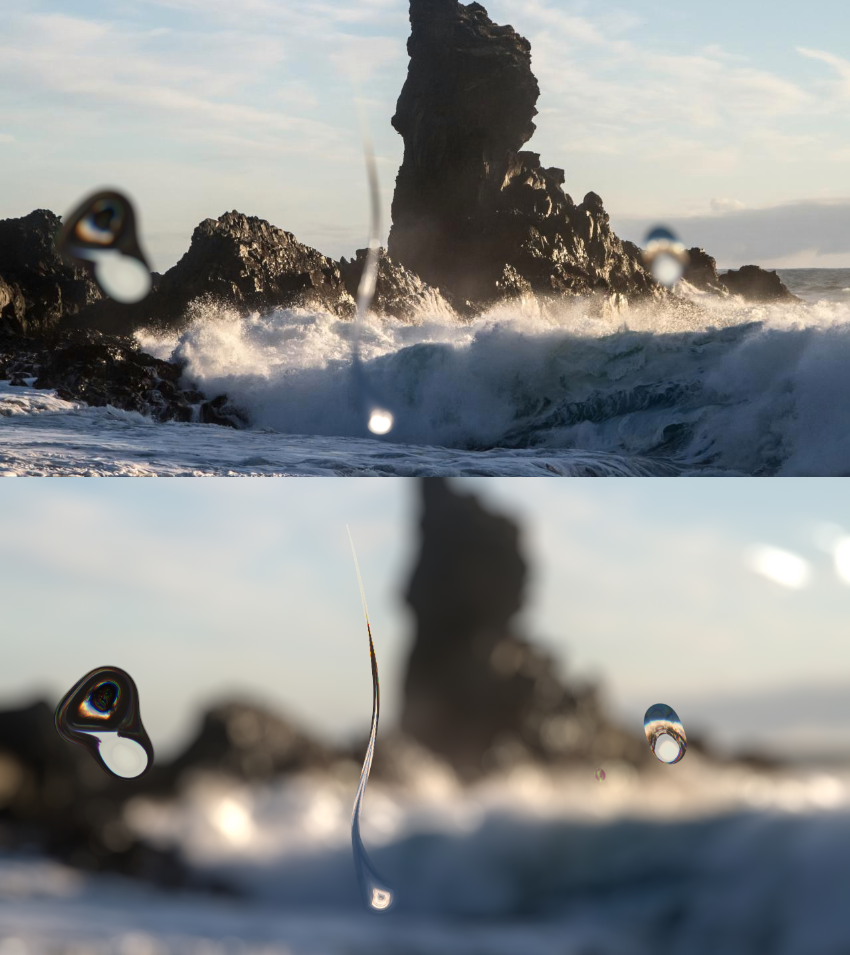

# WaterLens MJT

**Author:** Mark Joey Tang - [http://www.facebook.com/MJTlab](http://www.facebook.com/MJTlab)

- [http://www.nukepedia.com/gizmos/draw/waterlens_11](http://www.nukepedia.com/gizmos/draw/waterlens_11)

Create water droplet on lens.
