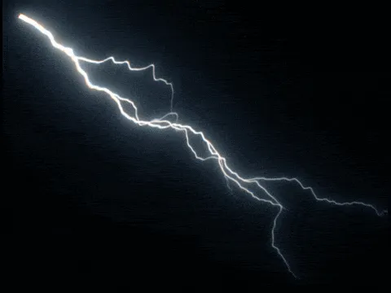

# X_Tesla XM

**Author:** Xavier Martin - [http://www.xaviermartinvfx.com/articles/](http://www.xaviermartinvfx.com/articles/)

- [http://www.nukepedia.com/gizmos/draw/x_tesla](http://www.nukepedia.com/gizmos/draw/x_tesla)
- [http://www.xaviermartinvfx.com/x_tesla/](http://www.xaviermartinvfx.com/x_tesla/)

With this Gizmo you will be able to create lightning and electricity effects. Animated electric arcs will be procedurally created between two points.

The gizmo includes some realistic render option such as the temperature based chromatic aberration and glow, an advanced soften filter, an easy to use 2 colour system. Or you can just disable everything with a simple check box, that's also OK.
