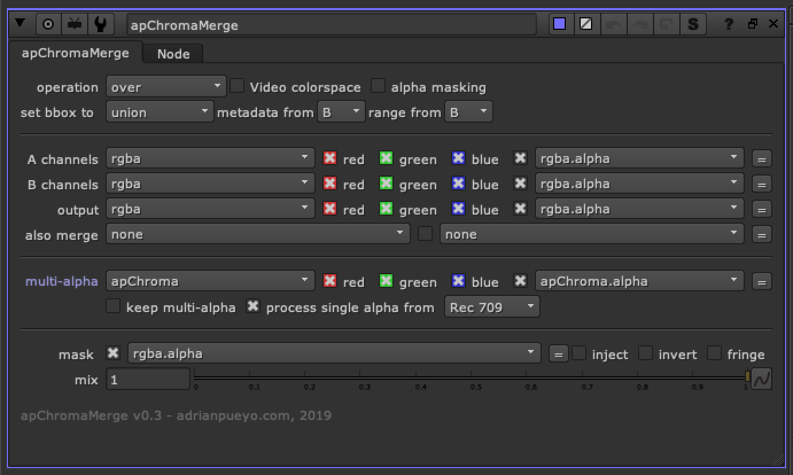

# apChromaMerge AP

**Author:** Adrian Pueyo - [http://www.adrianpueyo.com/](http://www.adrianpueyo.com/)

apChromaMerge is the final step in the apChroma Workflow. When using the apChroma toolset, a new layer, apChroma will be in the channels stream. This layer(channel) is storing each 'alpha' to be used per channel.

Since there is separation between the channels, whether they are transformed or blurred differently, they also need individual alphas to properly merge them over the background image.

You will find the normal options of a merge, with the option to:
- Keep the mult-alpha apChroma layer and pass it onto the this merge stream
- Since there are 3 alphas being used to merge each channel (red, green, blue) it's difficult to know which alpha to use for the final alpha to be passed onto this stream, representing the A inputs final alpha. By default, process single alpha from Rec 709 is checked on, meaning all 3 channels will be desaturated with the Rec 709 algorithm to produce a new greyscale alpha off the (luminance) and this will represent the new alpha channel to be passed onto the B stream after the merge.

