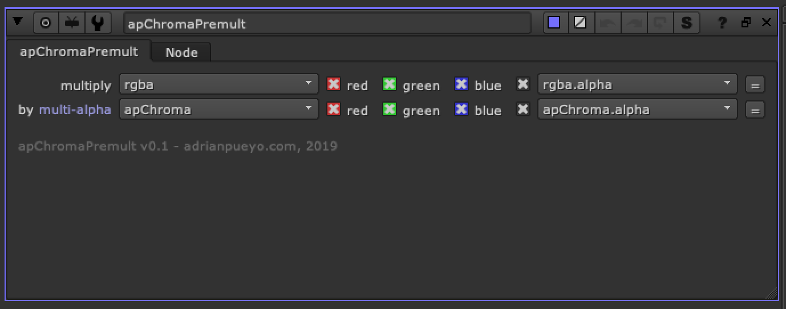

# apChromaPremult AP

**Author:** Adrian Pueyo - [http://www.adrianpueyo.com/](http://www.adrianpueyo.com/)

There are some rare cases where you will need to unpremult and premult all layers(channels) by the apChroma multi-alpha layer. Whether it's for color corrections, lightwrap, or something else, this node gives you the option to successfully unpremult and premult during the apChroma workflow.

