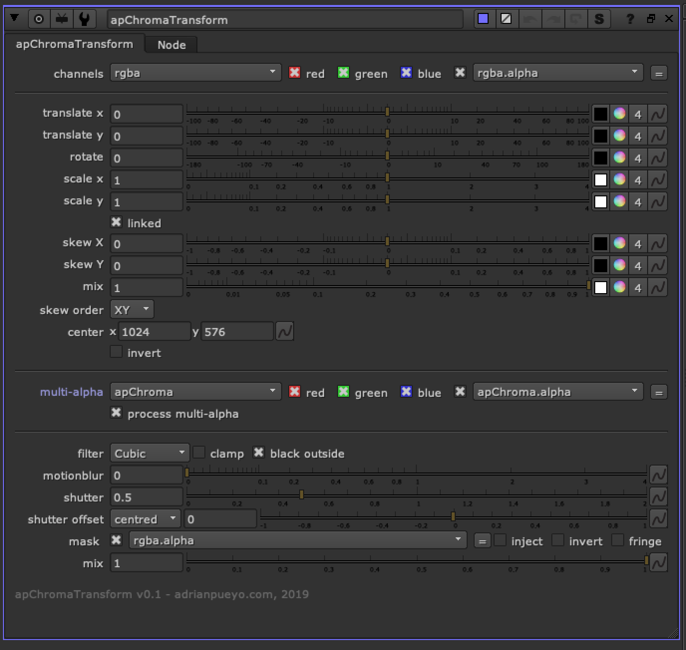

# apChromaTransform AP

**Author:** Adrian Pueyo - [http://www.adrianpueyo.com/](http://www.adrianpueyo.com/)

This tool allows you to transform red, green, and blue channels separately, and for all Layers (channels) in the stream.

Each transform knob can be broken up to r,g,b,a channels and individually manipulated.

To be used with the apChroma multi-channel alpha workflow so that apChromaMerge can be used.
