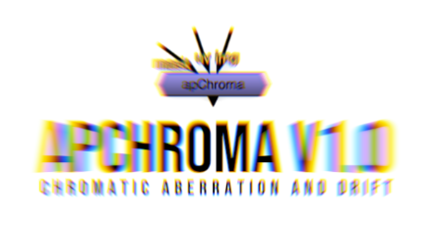
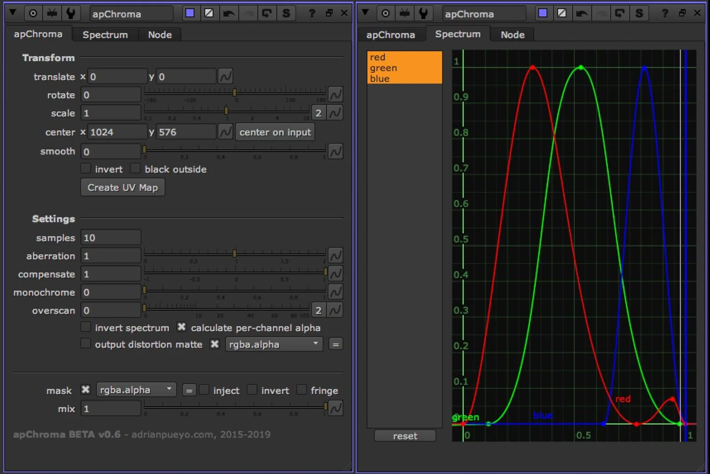

# apChroma AP

**Author:** Adrian Pueyo - [http://www.adrianpueyo.com/](http://www.adrianpueyo.com/)

- [http://www.nukepedia.com/gizmos/filter/apchroma](http://www.nukepedia.com/gizmos/filter/apchroma)
- Video: [https://youtu.be/K28VNUVseTY](https://youtu.be/K28VNUVseTY)

apChroma is an advanced chromatic aberration and drift gizmo, that works through a sub-frame blend of different values on an STMap and Transform, while creating a user-defined color spectrum.
apChroma can calculate a multi-channel alpha for correct merging of the result onto a plate, and the included apChromaMerge node will perform the multi-alpha merge operation.

