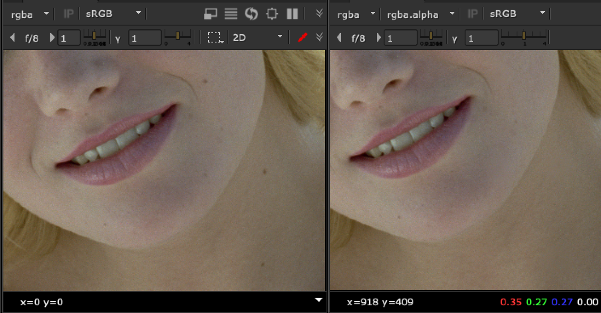
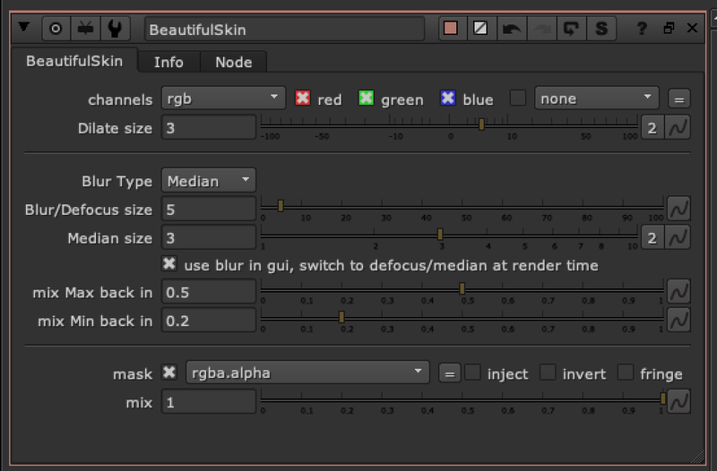

# BeautifulSkin TL

**Author:** Tony Lyons - [https://compositingmentor.com](https://compositingmentor.com)

Simple tool that uses erode dilate, blur, defocus, median with a mask to paint out moles, artifacts, markings, etc while maintaining a soft smooth appearance. Ability to bring back min/max values with separate sliders. Best when used with mask.

