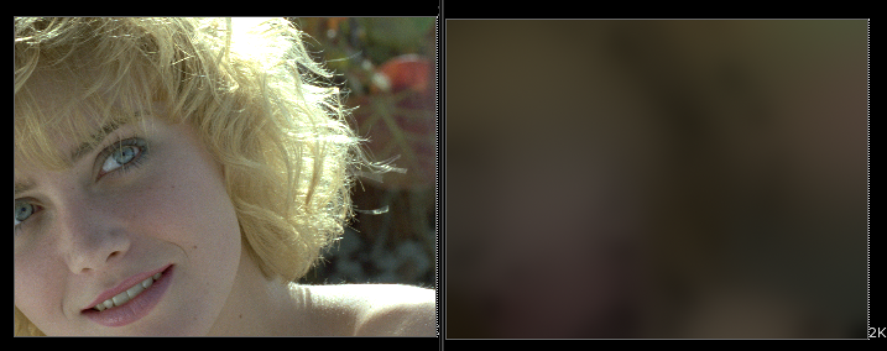
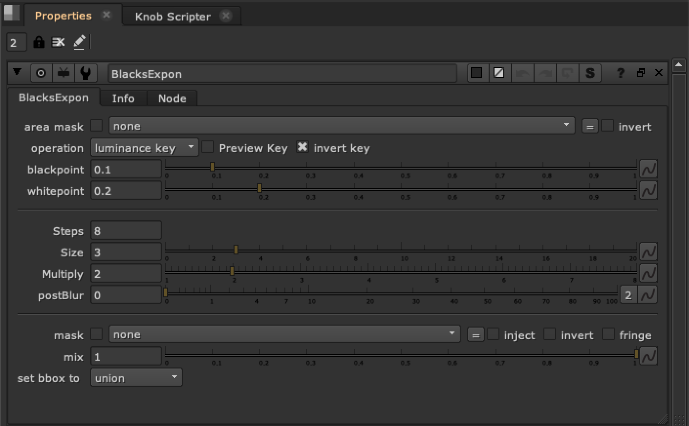

# BlacksExpon TL

**Author:** Tony Lyons - [https://compositingmentor.com](https://compositingmentor.com)

This tool Exponentially blurs the lows of the plate with a merge(Min) operation. Basically trying to find the low colors and spread them out using blur/unpremult technique. This can be quite handy if used with the blacksMatch tool color input. If you have a plate with dynamic lighting, it can be a handy way to get an animated black color for free to match your CG renders too. Can also help with prep tasks if you need to paint out highlights and replacing with a "base" color.

