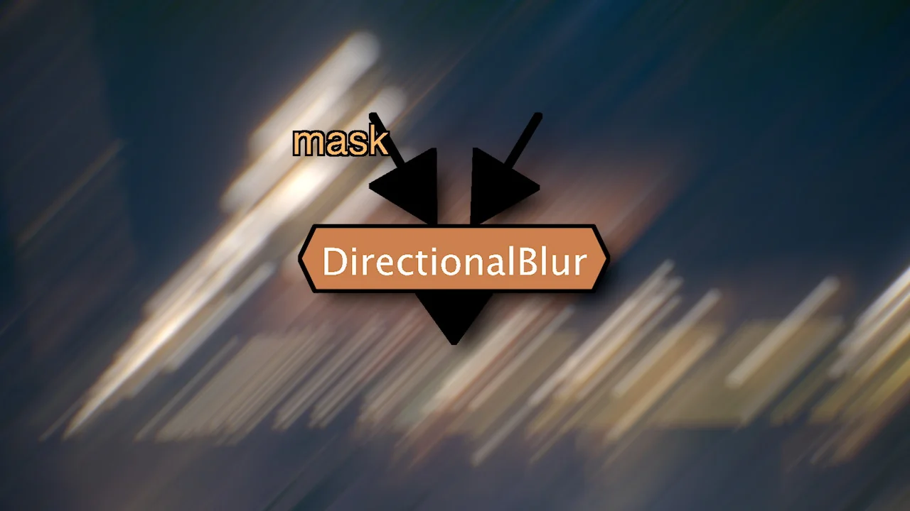

# Directional Blur TL

**Author:** Tony Lyons - [https://compositingmentor.com](https://compositingmentor.com)

- [http://www.nukepedia.com/gizmos/filter/directionalblur](http://www.nukepedia.com/gizmos/filter/directionalblur)

Select the rotation angle and size of the blur. Choose between blur and defocus. Has a perpendicular blur that blurs in the perpendicular direction to the angle chosen.

Some helpful options for managing your BBox. Has channels, mask, mix, etc.

