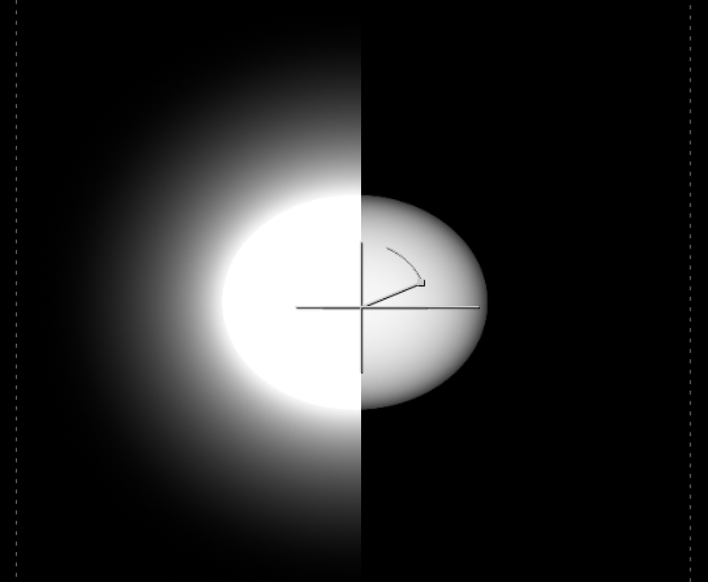
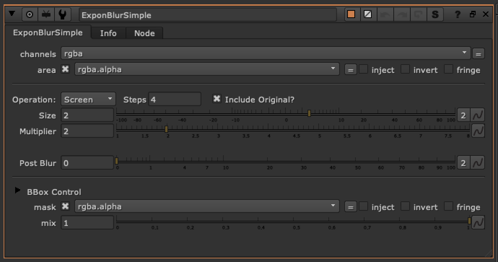

# ExponBlurSimple TL

**Author:** Tony Lyons - [https://compositingmentor.com](https://compositingmentor.com)

- [http://www.nukepedia.com/gizmos/filter/l_exponblur](http://www.nukepedia.com/gizmos/filter/l_exponblur)

Simple exponential blur iterating steps feature. Most often used with rotos/Mattes. Based on Luma Pictures ExponBlur gizmo.

Set your blur size and multiplier (exponent), and steps (iterations, # of blurs)
**Features:**
- Different types of Merge operations to choose from: Screen, Plus, Over, Hypot, Average, Max, Min (Can include original image in Merge)
- Has a clamp and post blur options
- If you go negative with the size, the matte will blur inwards (invert, blur, invert back). This can be used for softly eroding/blurring mattes and alpha edges
- BBox optimization, which has a safe BBox mode that will stop the bbox from growing 10% beyond the format size (or input BBox size, whichever is bigger). You can adjust this amount, or change to pixels instead of percent. And final BBox adjustment, so you can further grow/shrink the final bbox (in percent or pixels)

