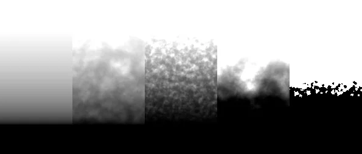
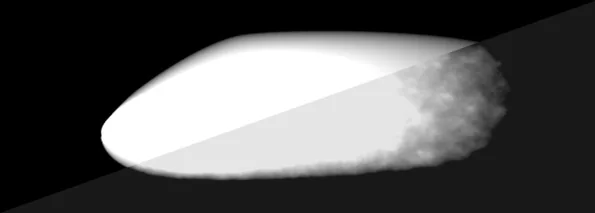

# FractalBlur NKPD

**Author:** Richard Frazer

- [https://richardfrazer.com/tools-tutorials/fractal-blur-for-nuke/](https://richardfrazer.com/tools-tutorials/fractal-blur-for-nuke/)
- [https://github.com/RichFrazer/fractal-blur/blob/master/fractal-blur.nk](https://github.com/RichFrazer/fractal-blur/blob/master/fractal-blur.nk)

It's essentially just a blur combined with a noise filter so that the softened image does not have smooth gradients. It really helps to hide soft-edge mattes where the combined images have a lot of texture.

I was working on Where the Wild Things Are at the time and every plate almost entirely consisted of heavy natural texture (forests, trees, fur etc.) and it became essential to use the fractalBlur on every single mask. Since then I frequently require this plugin and have not found an equivalent in Nuke, so thought I'd put one together.

