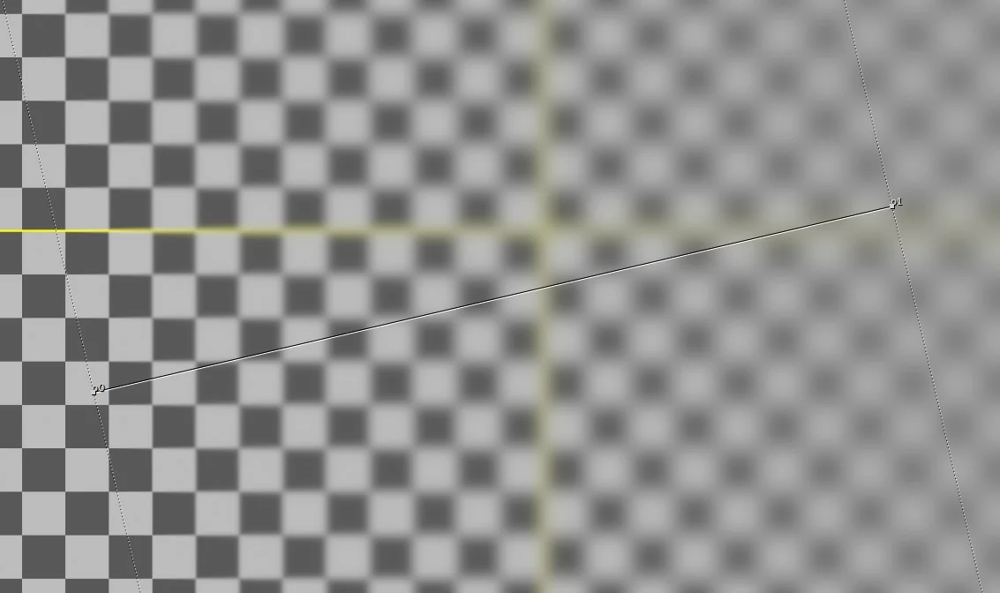

# IBlur NKPD

**Author:** Moritz Eiche

- [http://www.nukepedia.com/gizmos/filter/iblur](http://www.nukepedia.com/gizmos/filter/iblur)

With this gizmo you get a smoothly ramped blur on your image, based on the matte input. It works like 'iBlur'/'iDefocus' in Shake.

It's faster and easier than 'ZBlur', also you can choose between 'blur' and 'defocus'.
**Updates by Tony Lyons:**
- Allowed for x,y individual size options
- Added some better BBox management

