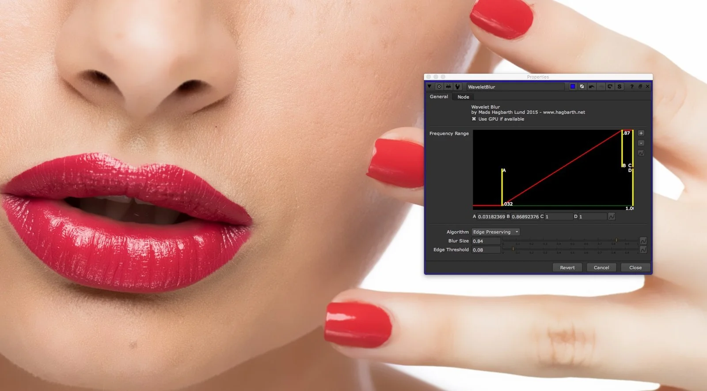

# WaveletBlur MHD

**Author:** Mads Hagbarth Damsbo - [https://hagbarth.net/blog/](https://hagbarth.net/blog/)

- [http://www.nukepedia.com/gizmos/filter/wavelet-blur](http://www.nukepedia.com/gizmos/filter/wavelet-blur)

This tool allows you to pick a specific range of frequencies to blur in an image. Helpful for doing beauty and other work where preserving original image detail is important.

Using a BlinkScript powered bilateral filter, this tool also allows you to preserve edges of your footage, while still having good render times.

