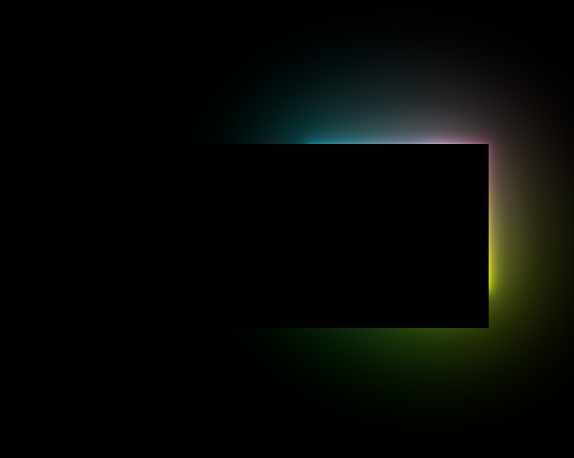
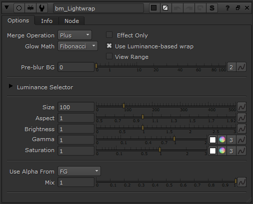

# bm_Lightwrap BM

**Author:** Ben McEwan - [https://benmcewan.com/blog/](https://benmcewan.com/blog/)

- [http://www.nukepedia.com/gizmos/filter/bm_lightwrap](http://www.nukepedia.com/gizmos/filter/bm_lightwrap)
- [https://github.com/BenMcEwan/nuke_public](https://github.com/BenMcEwan/nuke_public)
- [https://benmcewan.com/nukeTools.html](https://benmcewan.com/nukeTools.html)

Like bm_OpticalGlow, this adds exponentially-increasing blurs together to produce a more optically-correct, natural lightwrap.

