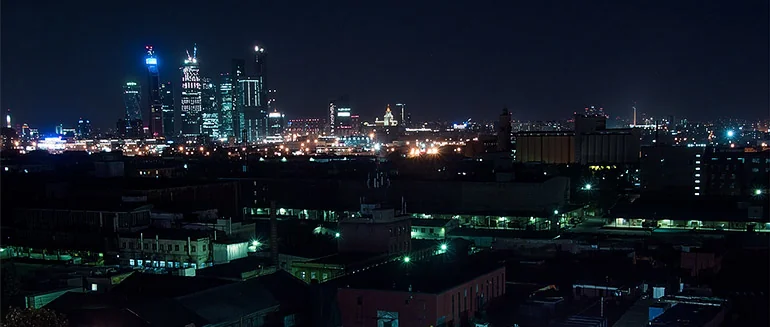

# CatsEyeDefocus NKPD

**Author:** Alexander Kulikov

CatsEyeDefocus is a convolution filter which simulates swirly bokeh.

This lens abnormity is also called cat's eye effect and it is noticeable when an aperture goes wide. The shape of the bokeh progressively narrows from the image center towards the edges and starts to resemble a cat's eye.

