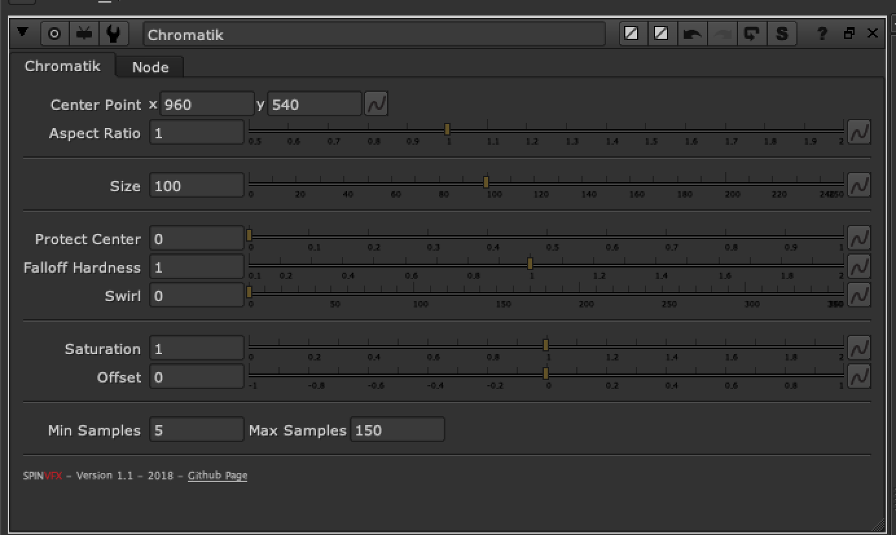
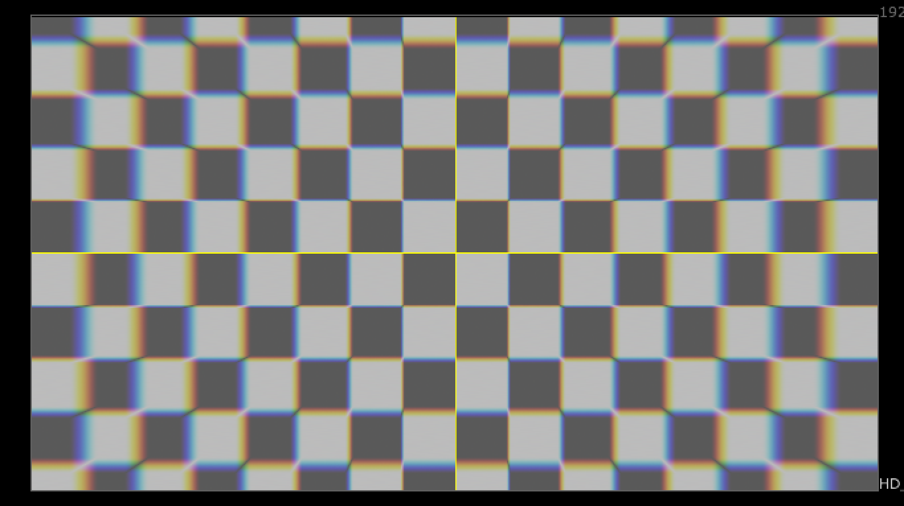

# Chromatik SPIN

**Author:** SPIN FX

- [http://www.nukepedia.com/gizmos/other/spin_nuke_gizmos-1](http://www.nukepedia.com/gizmos/other/spin_nuke_gizmos-1)
- [https://github.com/SpinVFX/spin_nuke_gizmos](https://github.com/SpinVFX/spin_nuke_gizmos)
- Video: [https://vimeo.com/381270956](https://vimeo.com/381270956)

Chromatic aberration node using a spectral wavelength gradient.

