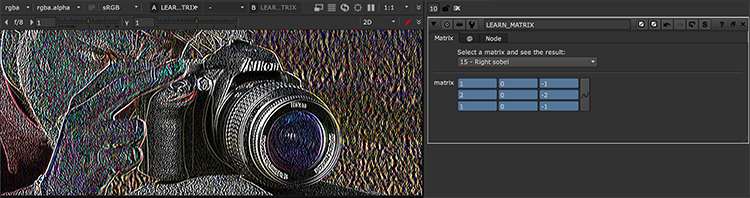
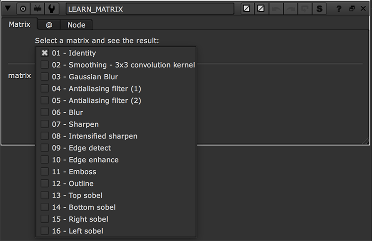

# ConvolutionMatrix AG

**Author:** Andrea Geremia - [http://www.andreageremia.it/tutorial.html](http://www.andreageremia.it/tutorial.html)

- [http://www.nukepedia.com/gizmos/filter/learn_matrix](http://www.nukepedia.com/gizmos/filter/learn_matrix)
- [http://www.andreageremia.it/tutorial_matrix.html](http://www.andreageremia.it/tutorial_matrix.html)

Apply a preset Matrix Filter 3x3 to your image.

