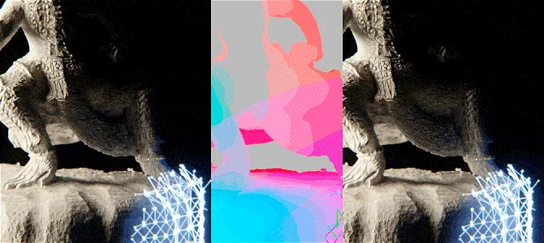

# DeflickerVelocity NKPD

**Author:** Julien Vanhoenacker

Part of the CG artist's job is to balance rendering time and quality. Low rendering quality often resulting in aliasing, or flickering, specially on raytrace renderers. To find the right balance means to test render with different settings in order to find the one that render the fastest while still being acceptable in terms of aliasing and flickering. But this is time consuming and the render time necessary to achieve this result might also be quite high. It is therefore interesting to find tricks to improve quality with equal or even lower render times. It is possible to use built-in denoisers, however this becomes useless if the flickering happens on the edges of the objects, or if it is on wide GI artefacts (as in lightcache or irradiance GI), and tends to make the image blurry. The technique we present here is deflickering based on previous and next frames.

<video autoplay loop muted playsinline style="width:100%">
  <source src="../img/tools/filter/deflicker-velocity-1.mp4" type="video/mp4">
</video>

### Basic Deflickering

Consider this, a static or very slow camera movement, and slow or no animations in the scene. This is a scenario where flickering will be most obvious as very little is changing in the scene. This is also a scenario where deflickering is the easiest to achieve. Offset time by -1 frame to get the previous frame, merge it at 50% on top of your current frame, Offset time by +1 frame to get the next frame, merge it at 33% on top of your previous result and voila! Your compositing is now averaging previous, current and next frame and as a result, flickering, aliasing and noise are decreased by 3. And because the camera and animation are not or slowly moving, the averaging is close to invisible, apart in the overall gained stability in the picture.

The Deflickering is specially useful when dealing with sharp self-illuminating object that create complex GI solutions...

### Masking

Now a situation where nothing is moving in the scene is uncommon. In the case where something is bouncing around, it should definitely not be averaged, otherwise this will result in an ugly 3 frame long stepped motion blur that nobody wants. The good news is that if the object is actually moving quite fast while the rest of the scene is quiet, the flickering will most likely not be noticeable on this object, since its position, angle, lighting will be changing every frame. It is therefore ok to not deflicker it, while still deflickering the surroundings. In order to do that we can just mask it out of the deflicker.

Now nobody likes to animate roto shapes, so a quick tip to automatically mask the fast moving subject is to use the velocity pass that you have cleverly rendered beforehand. The velocity pass is actually a colored representation of the speed of each pixels, so all we have to do is to key in static (grey) pixels, key out fast (colorful) pixels and use the resulting alpha as a mask for the deflickering, the tolerance of the keying will dictate how much deflickering you want.

### Deflickering with Velocity pass

Now in some cases, things are not that easy. For example a not so slow but smooth camera pan or track, or an object slowly shifting in the opposite direction will result in quite visible flickering, and would give ugly results with basic deflickering. Here we want to use the aforementioned velocity, but not for masking anymore. The velocity channel stores in the red and green channel the velocity of a pixel as a 2D vector. Following the same principle as before, we want to offset time to get the previous frame, and use the velocity pass with a displacement node to distort this frame 'forward' and align it with the current frame. Realign the next frame 'backward' and blend the whole thing together and you get a result that is deflickered, with movement. Now this technique is quite powerful and can save your life in a tight deadline. Of course there are still limitations for super fast moving objects and very separate foreground and backgrounds, but mixing this with the previous mask technique, you can deal with pretty much anything...

### Extra Tip 1:

For those who use Vray, it is important in the DMC settings to uncheck "Time independent", to enable a noise that changes every frame, otherwise averaging will still display the same amount if noise.

### Extra Tip 2:

Also for VRay users, you will notice if you separate your renders into elements, that flickering is mostly in the GI pass, and sometime in reflection or speculars... The deflickering can be applied only on these passes, leaving the other passes intact...

### Extra Tip 3:

You can use multiple Deflickering nodes one after another to average 5, 7, 9 or even 11 frames together, depending on your type of animation/camera move…
