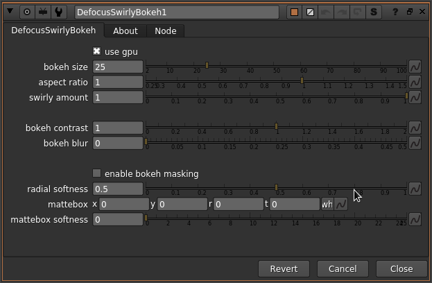

# DefocusSwirlyBokeh NKPD

**Author:** Jed Smith

- [https://gist.github.com/jedypod/5d35858d488df478aaf2f2e8f3f7875a](https://gist.github.com/jedypod/5d35858d488df478aaf2f2e8f3f7875a)

Creates Swirly Bokeh or Cat's Eye Bokeh shapes on the edges of frame. Does not perform depth-varying defocus. Needs a good GPU to run fast.

Based on Alexander Koolikov's CatsEyeDefocus.
