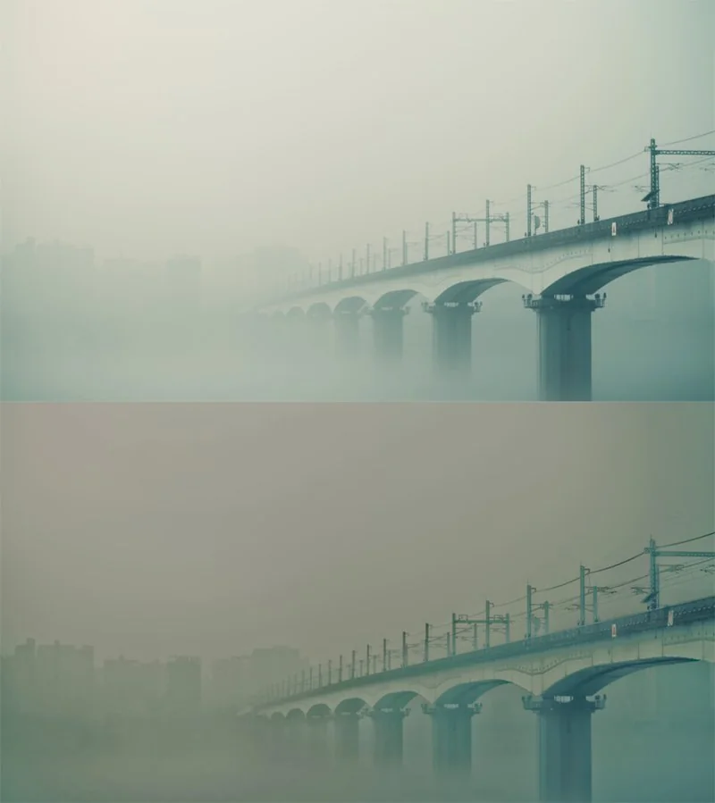
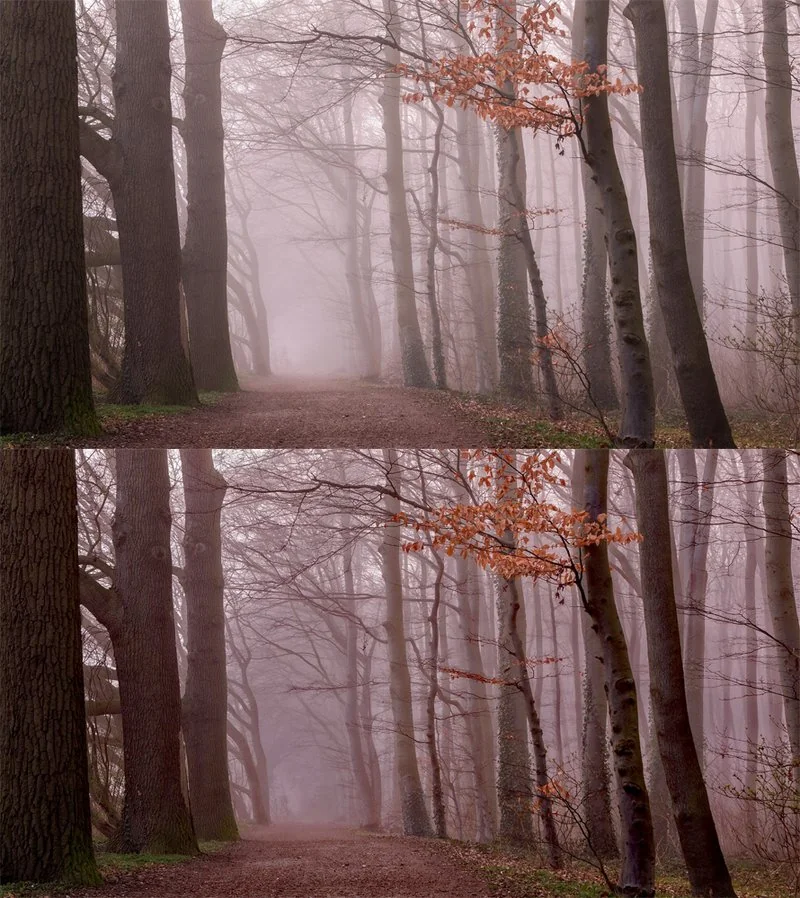

# deHaze NKPD

**Author:** Lucas Pfaff

deHaze is build after the great dehazing-tutorial made by Mads Hagbarth Damsbo. Mads concludes the tutorial with 'So you can just package this up and make a cool tool and put it Nukepedia', so I gave it a try :)
I added some functionality to shuffle the affected areas into the alpha channel, as well as colour correct the footage based on this matte. Results vary highly with the given shot, it always needs a bit of fiddling around. I highly recommend watching the tutorial to understand the underlying principle.

**Note:** Needs Nuke 12 for the C_Bilateral node.

